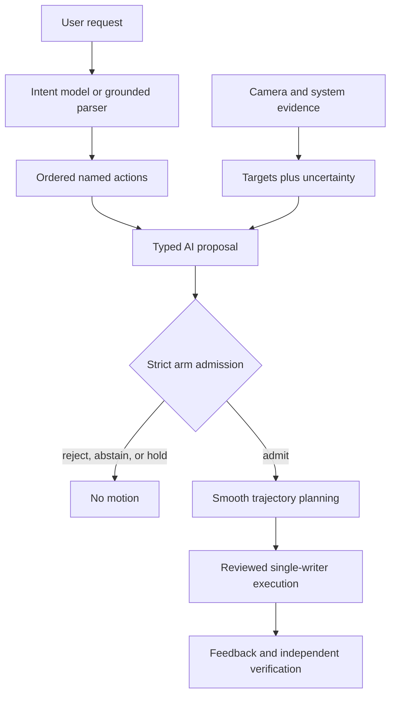

# Tactevra


[](https://github.com/j-webtek/tactevra/actions/workflows/offline-checks.yml)
[](https://github.com/j-webtek/tactevra/actions/workflows/repository-health.yml)
[](LICENSE)

**The enabling fabric between AI intent and physical interaction.**

Tactevra connects language, visual evidence, and specialized AI models to
checked robot-arm actions. Models describe *what* should happen; deterministic
software decides *whether and how* movement may proceed, records the result,
and keeps unverified proposals away from the motors.

[Get started](docs/GETTING_STARTED.md) ·
[System overview](docs/SYSTEM_OVERVIEW.md) ·
[Project status](PROJECT_STATUS.md) ·
[Documentation](docs/README.md) ·
[Roadmap](ROADMAP.md) ·
[Contribute](CONTRIBUTING.md)

## Mind, nervous system, and body

An AI command is like a thought: it expresses intent about what should happen.
It is not yet a motor command, permission to move, or proof that the world is
in the expected state.

Tactevra is the nervous system between that intent and a robotic body. It
carries observations inward, binds a proposed action to current evidence,
checks whether the action is permitted, translates admitted intent into
bounded movement, and carries results back for verification. The model does
not directly twitch a motor any more than a passing thought directly defines
every muscle signal.

| Role in the metaphor | Tactevra component | Responsibility |
| --- | --- | --- |
| **Mind** | User intent and specialized AI models | Interpret a goal, recognize a relevant event or object, and propose what action should occur |
| **Senses** | Cameras, device state, and controller feedback | Describe what is present now, with freshness, identity, and uncertainty |
| **Nervous system** | Contracts, admission, transforms, planning, execution, and evidence records | Decide whether a proposal may become action and coordinate how it safely reaches the body |
| **Body** | Robot arm, tool, fixtures, and workcell | Perform the admitted physical movement within measured limits |
| **World** | Keyboards, phones, controls, and other physical targets | Supply the objects, conditions, and independently observable effects of action |

For example, a model may be asked to watch for an object and act when it
appears. The model identifies the condition and proposes the intended target;
Tactevra then requires fresh scene evidence, validates the target and current
configuration, plans an allowed movement, gives the controller one bounded
piece of work, and checks what actually happened. This closed loop is the
connection from AI ideation to physical interaction:

```text
observe the world
    → understand intent and context
    → propose an evidence-bound action
    → check and translate it
    → move through one controlled path
    → verify the physical effect
    → return new evidence to the system
```

The metaphor describes system responsibilities, not consciousness. Tactevra
is neither the AI model nor the arm; it is the governed connective layer that
lets independently developed intelligence and hardware work together without
confusing a plausible idea with an authorized physical act.

## Current readiness

Tactevra has completed its planned **pre-camera software integration**. The
repository can accept actual AI-produced action batches, validate their
evidence, preserve ordered typing targets, generate smooth offline
trajectories, and reject stale, malformed, uncertain, or unauthorized input.

It has **not** yet demonstrated reliable autonomous physical typing. The final
camera, measured workcell transforms, real localization bounds, installed
collision evidence, and independently verified key contact remain required.

| State | What it means |
| --- | --- |
| **Ready now** | Hardware-free request parsing, versioned AI-to-arm contracts, strict admission, ordered trajectory generation, deterministic replay, fault testing, and camera-arrival tooling |
| **Waiting on physical evidence** | Final-camera calibration, measured robot/device/tool transforms, real localization bounds, and installed cable/geometry qualification |
| **Not yet demonstrated** | Reliable autonomous physical typing, verified strings, or phone operation |

The latest compatibility corpus exercises mixed typing and all 46 named
keyboard targets while retaining zero hardware authority. The current
precision-model uncertainty remains too large for safe key contact, so the arm
runtime correctly blocks it. See [project status](PROJECT_STATUS.md) for dated
evidence and exact limitations.

## Choose your path

| If you want to… | Start here |
| --- | --- |
| Run the hardware-free walkthrough | [Getting started](docs/GETTING_STARTED.md) |
| Understand the request-to-result architecture | [System overview](docs/SYSTEM_OVERVIEW.md) |
| Review evidence, readiness, and limitations | [Project status](PROJECT_STATUS.md) |
| Explore the local setup and diagnostic interface | [Tactevra Studio workbench](software/docs/WIZARD_WORKBENCH.md) |
| Integrate AI output with the arm runtime | [Shared AI/arm workplan](software/ai/docs/SHARED_AI_ARM_WORKPLAN.md) |
| Develop the runtime | [Software reference](software/README.md) |
| Plan or source a workcell | [Workcell replication guide](docs/WORKCELL_REPLICATION.md) |
| Build the workcell | [Hardware build guide](docs/HARDWARE_BUILD_GUIDE.md) |
| Contribute or maintain the repository | [Contributing](CONTRIBUTING.md) · [Repository operations](docs/REPOSITORY_OPERATIONS.md) |
| Find a specific technical document | [Documentation index](docs/README.md) · [Glossary](docs/GLOSSARY.md) |

## Try the offline pipeline

The hardware-free walkthrough demonstrates the AI-to-arm software boundary
without moving an arm or downloading a model:

```text
user text
    → ordered named actions
    → nominal coordinate preview
    → explicit execution blockers
    → no controller commands
```

### 1. Install

Windows PowerShell and Python 3.10 or newer are sufficient for this abbreviated
path. See the documented [base installation](docs/GETTING_STARTED.md#install-the-software)
for supported context and verification details.

```powershell
git clone https://github.com/j-webtek/tactevra.git
cd tactevra
python -m venv .venv
.\.venv\Scripts\python -m pip install -e './software'
```

### 2. Interpret a request

```powershell
.\.venv\Scripts\python software/ai/run_offline.py ground --request 'Type "hi" on the keyboard'
```

The output contains an ordered proposal for H followed by I. It is a structured
plan—not a keystroke and not permission to move hardware.

### 3. Preview nominal targets

```powershell
.\.venv\Scripts\python software/ai/run_offline.py coordinate-preview --request 'Type "hi" on the keyboard'
```

This exposes candidate coordinates and the prerequisites still missing before
execution. The preview deliberately produces no controller commands, opens no
transport, and grants no physical authority.

For expected results, troubleshooting, and the optional local interface, follow
the complete [getting-started guide](docs/GETTING_STARTED.md).

## Replicating the workcell

The physical system combines a robot arm, a registered work surface, printed
fixtures, input devices, camera hardware, fasteners, and calibrated tooling.
Because several selections still depend on measured fit, the project does not
present a single-click shopping cart as if every component were fully qualified.

Start with the [workcell replication guide](docs/WORKCELL_REPLICATION.md). It
collects the currently specified parts and materials, distinguishes confirmed
requirements from candidates and measurement-dependent selections, and points
to the authoritative BOMs:

- [`active-project/RoCell_v0_3/BOM.csv`](active-project/RoCell_v0_3/BOM.csv)
  for the RC03 workcell;
- [`hardware/static_overhead_camera/BOM_PRINTABLE_FRAME.csv`](hardware/static_overhead_camera/BOM_PRINTABLE_FRAME.csv)
  for the printed camera portal; and
- the [hardware build guide](docs/HARDWARE_BUILD_GUIDE.md) for readiness,
  fabrication, and assembly controls.

The replication guide is a maintained procurement index. Controlled BOMs,
revisioned build records, and physical acceptance checks remain authoritative.

## How the system works



The system follows five stages:

1. **Perceive** — collect image and system-state evidence.
2. **Propose** — translate intent into typed, coordinate-aware actions.
3. **Check** — validate identity, calibration, freshness, uncertainty,
   geometry, and policy.
4. **Execute** — convert an admitted plan into bounded controller work through
   one command owner.
5. **Verify** — distinguish controller feedback from independent confirmation
   that the requested device effect occurred.

The ownership boundary is deliberate:

- **Tactevra AI** interprets requests, evaluates scenes, and proposes named
  targets with evidence and uncertainty. It does not write servo commands.
- **Tactevra Runtime** owns trust decisions, coordinate transforms, planning,
  collision policy, execution authority, controller communication, and result
  records.
- **Tactevra Workcell** combines the arm, camera, tools, fixtures, cables, and
  measured environment.
- **Tactevra Studio** provides local setup, rehearsal, task review, evidence
  collection, and diagnostics.

Shared contracts keep these workstreams compatible without collapsing their
responsibilities. A plausible model result remains only a proposal until the
runtime admits it.

## Capability and evidence surface

| Capability | Current standing | Next requirement |
| --- | --- | --- |
| Text interpretation | Supported keyboard requests become ordered named actions | Broader held-out language evaluation |
| AI-to-arm interface | Actual emitter output passes the strict versioned contract | Maintain compatibility as models and contracts evolve |
| Keyboard targets | Mixed sequences and all 46 named targets compile offline in exact order | Real-camera coordinate qualification |
| Perception | Scene-quality, precision-adapter, saved-image, and abstention paths exist | Final-camera evaluation and a bound that fits applicable key-safe regions |
| Motion planning | Ordered smooth trajectories and lifecycle records compile offline | Installed transforms, IK, cable, and collision qualification |
| Controller runtime | Ownership, encoding, feedback matching, deadlines, and no-ambiguous-retry behavior are rehearsed | Installed-controller qualification and measured timing |
| Physical interaction | Earlier supervised movement and feedback experiments provide development evidence | One measured non-contact hover, then one independently verified keypress |
| Phone operation | Contracts and planning concepts exist | Qualified screen perception, state transitions, and verified taps |

The words *implemented*, *simulated*, *measured*, and *verified* are not
interchangeable in this project. Detailed test counts, firmware history, and
dated evidence belong in [project status](PROJECT_STATUS.md) and the
[evidence ledger](software/ai/docs/EVIDENCE_LEDGER.md).

## Next physical milestone

The next goal is not another arbitrary ghost-motion routine. It is one
camera-guided, measured, independently checked interaction:

1. Install and identify the final fixed camera.
2. Collect the required physical-original evidence.
3. Measure camera, board, keyboard, robot-base, and tool transforms.
4. Commission one coherent configuration epoch.
5. Evaluate localization on held-out real captures.
6. Establish an uncertainty bound that fits the intended target's safe region.
7. Screen installed robot, attachment, cable, and workspace geometry.
8. Qualify one slow non-contact hover from a fresh observed arm state.
9. Qualify one keypress with independent device-effect verification.
10. Expand to held-out short strings before measuring sustainable typing speed.

The prepared [camera-arrival checklist](software/docs/CAMERA_ARRIVAL_DAY_CHECKLIST_V1.md)
and [shared AI/arm workplan](software/ai/docs/SHARED_AI_ARM_WORKPLAN.md) govern
this transition. Passing an offline compatibility test cannot skip these steps.

## Why Tactevra

Giving an AI model a physical appendage introduces a boundary that ordinary
software agents do not have: a plausible answer can become real motion.
Tactevra makes that boundary explicit and inspectable.

| Principle | What it means in Tactevra |
| --- | --- |
| **Semantic, not servo-level input** | AI components propose named actions and evidence-bound targets rather than writing raw motor commands. |
| **Deterministic admission** | Runtime checks own calibration, coordinate transforms, freshness, reachability, motion policy, and execution authority. |
| **Observable outcomes** | Proposed, accepted, transmitted, reported, and independently verified states remain distinct. |
| **Fail-closed behavior** | Missing, stale, incompatible, or uncertain evidence blocks progress instead of being silently guessed. |
| **Local-first development** | Core rehearsal, parsing, simulation, and validation paths can be inspected without a cloud control plane. |

The first workcell uses a Waveshare RoArm-M3 to research interaction with tools
designed for people—initially keyboards and phone interfaces. The architecture
is intended to remain useful beyond one arm, model, or device.

## Watch the architecture

[](https://j-webtek.github.io/tactevra/)

[Watch the narrated explainer](https://j-webtek.github.io/tactevra/) to follow a
request through perceive, propose, check, execute, and verify. The rendered
keypress is labeled as a simulation and illustrates the system design rather
than physical-qualification evidence.

## Repository map

| Path | Purpose |
| --- | --- |
| [`software/`](software/README.md) | Runtime, interfaces, simulations, firmware sources, and tests |
| [`software/ai/`](software/ai/README.md) | Language, vision, evaluation, and proposal-generation research |
| [`active-project/RoCell_v0_3/`](active-project/RoCell_v0_3/README_FIRST.md) | Current RC03 mechanical design and assembly package |
| [`hardware/static_overhead_camera/`](hardware/static_overhead_camera/README.md) | Fixed-camera structure and integration resources |
| [`docs/`](docs/README.md) | User, architecture, governance, evidence, and operations documentation |
| [`scripts/`](scripts/) | Repository maintenance and development tools |

`rocell` remains the package, command, and historical hardware identifier for
compatibility. New public product language uses **Tactevra**.

## Development and governance

```powershell
.\.venv\Scripts\python -m pip install -e './software[test]'
.\maintain-repository.ps1 verify
```

Changes are reviewed through protected `main`, scoped offline verification,
shared-contract routing, and evidence-retention rules. These controls improve
traceability; they do not themselves qualify a physical setup or authorize a
release. Start with [contributing](CONTRIBUTING.md), then use
[governance](GOVERNANCE.md) and the [roadmap](ROADMAP.md) for decision and
delivery boundaries.

For help, use [support](SUPPORT.md). Report vulnerabilities through the
[private security process](SECURITY.md).

## License and attribution

Original contributions are licensed under the
[Apache License, Version 2.0](LICENSE). Third-party code, models, drawings, and
vendor assets retain their respective terms. Review
[third-party notices](THIRD_PARTY_NOTICES.md) and the linked provenance records
before redistribution.

Copyright 2026 Tactevra contributors. See [CHANGELOG.md](CHANGELOG.md),
[versioning](docs/VERSIONING.md), and [CITATION.cff](CITATION.cff) for project
history and citation metadata.
