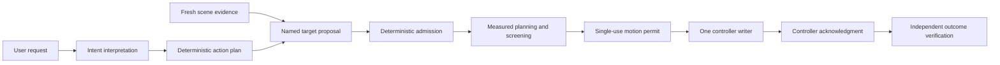

# Tactevra system overview

- **Document status:** Current overview
- **Audience:** Users, contributors, reviewers, and integrators
- **Authority:** Explanatory; it does not authorize hardware operation

Tactevra is a governed interface between AI models and the physical world. It
connects a person's request and fresh visual evidence to an inspectable series
of software decisions and, eventually, a verified physical action. The project
deliberately keeps interpretation, motion authority, controller communication,
and outcome verification separate. Passing one stage never implies that a later
stage ran.

For the latest evidence-backed capability statement, read
[project status](../PROJECT_STATUS.md). For terms used below, see the
[glossary](GLOSSARY.md).

## End-to-end flow

The repository contains implemented pieces of this flow, but it does not yet
contain a generally qualified camera-to-arm typing system. The default public
walkthrough stops before physical execution.

## The nervous-system analogy

“Nervous system for embodied AI” is a product metaphor for the boundaries in
the architecture; it is not a claim that the software is conscious or
biological.

| Metaphor | Tactevra responsibility |
| --- | --- |
| Objective | A person states the desired outcome in language |
| Senses | Cameras and declared context provide fresh scene evidence |
| Perception | AI components interpret the request and locate named targets |
| Nerve signal | Versioned semantic contracts carry actions, frames, confidence, uncertainty, and evidence identity |
| Reflexes and guardrails | Deterministic checks reject stale, malformed, unreachable, or unqualified proposals |
| Appendage | The robot arm performs only the motion granted by the runtime |
| Feedback | Independent observation determines whether the intended device interaction occurred |

This division is intentional. Models propose *what* the interaction means;
Tactevra Runtime owns *how* a physical action is checked, planned, authorized,
encoded, and recorded.

The experimental `hover_target` intent is an additive, simulation-only request
shape. It carries a device and named target without coordinates. Existing
typing consumers may continue to reject it; only an explicit hover consumer may
route it, and that consumer terminates before contact. Migration adds that
explicit route. Rollback removes the route and validator shape without changing
stored typing plans, motion batches, controller records, or transport data.

## Component responsibilities

| Component | Accepts | Produces | Must not claim |
| --- | --- | --- | --- |
| Intent interpretation | User text | Supported operation, device, literal text, or an explicit rejection | That arbitrary language is understood |
| Deterministic compiler | Supported intent | Ordered `rocell.action_plan.v1` actions and a plan hash | Coordinates, servo commands, or physical completion |
| Scene and localization research | Images and declared capture context | Scene assessment and named target proposals with frame and uncertainty | Qualified real-camera accuracy without measured evidence |
| Tactevra Runtime admission | Canonical proposal bytes and trusted registry state | Accepted or rejected planning input | Permission to bypass calibration, limits, or freshness checks |
| Planning and collision screening | Admitted target, current state, measured configuration | A sealed trajectory candidate or blocker | Continuous-world safety beyond the modeled and measured scope |
| Permit and controller boundary | Reviewed trajectory and fresh safety state | Single-use permit, encoded command, and correlated lifecycle records | That acknowledgment proves the intended key or screen action occurred |
| Outcome verification | Independent device or visual evidence | Verified, failed, or uncertain task result | Success from servo arrival alone |

## Names and compatibility

**Tactevra** is the product and repository name. **Tactevra Runtime** is the
arm-facing software component. Existing Python packages, commands, schemas,
configuration keys, and historical records retain the lowercase `rocell`
identifier for compatibility. **RoArm-M3** is the third-party Waveshare robot
arm. These names are related but are not interchangeable.

## Evidence levels

Results are described using distinct evidence levels:

1. **Software check:** parsing, validation, schema, or lifecycle behavior.
2. **Simulation:** a result under modeled geometry and assumptions.
3. **Controller feedback:** state reported by the robot controller.
4. **External measurement:** geometry measured independently of controller state.
5. **Independent outcome verification:** evidence that the intended device
   interaction actually occurred.

Evidence at one level does not establish the next. The
[project status](../PROJECT_STATUS.md) applies these distinctions to current
capabilities.

## Where to continue

- New users: [getting started](GETTING_STARTED.md)
- Current capabilities and blockers: [project status](../PROJECT_STATUS.md)
- AI and arm contributors: [shared workplan](../software/ai/docs/SHARED_AI_ARM_WORKPLAN.md)
- Runtime implementation: [software architecture](../software/docs/ARCHITECTURE.md)
- Repository contributors: [contributing](../CONTRIBUTING.md)
- Maintainers: [documentation standard](DOCUMENTATION_STANDARD.md) and
  [maintainer checklist](MAINTAINER_CHECKLIST.md)
