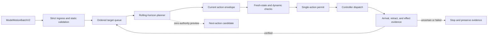

# Optimized typing execution plan

- **Document status:** Active plan; not a hardware procedure
- **Owners:** Arm/runtime lane, with shared AI/arm contract review
- **Audience:** Runtime, planning, controller, AI-integration, and qualification contributors
- **Reviewed:** 2026-09-27 against the `ModelMotionBatchV2` boundary
- **Authority:** Normative for the proposed typing executor; it grants no movement,
  torque, controller-startup, or deployment authority

## Outcome

Build a deterministic arm-side executor that turns an admitted, ordered model
batch into smooth keyboard motion while maximizing **verified useful characters
per minute**. The executor must not trade away target containment, collision
clearance, tracking margin, recovery, or independent key-effect verification to
increase raw command rate.

This plan deliberately separates proposal from authority:

- Tactevra AI supplies the requested action order, named targets, board-frame
  target geometry, evidence identity, confidence, and bounded uncertainty.
- Tactevra AI may supply typed, non-authoritative route preferences in a future
  schema version. It does not choose servo commands, joint limits, velocity,
  acceleration, jerk, contact depth, retry policy, or dispatch timing.
- Tactevra Runtime validates the proposal, computes and screens the trajectory,
  shapes motion, encodes controller commands, grants a one-action permit, and
  verifies the outcome.

The current system already preserves ordered targets and rejects malformed,
stale, unqualified, or geometrically uncontained V2 proposals. It does **not**
yet have a physically qualified high-throughput sequence executor. All work
below remains simulation, shadow, or bounded qualification work until its gate
is explicitly satisfied.

## Why a typing executor is needed

Treating every key as an unrelated mission is safe but slow: it repeats static
validation, often returns to a distant park pose, and prevents useful work from
being prepared ahead of time. Treating a complete word as one irreversible
controller program is fast but unsafe: later actions can become invalid after a
device shift, tracking error, missed key, or ambiguous contact.

The intended middle ground is:

1. admit and validate immutable batch facts once;
2. plan a small rolling window ahead;
3. authorize only the current action;
4. travel directly between qualified local hover states instead of returning to
   park after every key;
5. revalidate dynamic facts before every commit; and
6. use observed timing and tracking margins to select an arm-owned speed class.



## Input and output boundary

### Accepted input

The executor consumes only a strictly admitted `ModelMotionBatchV2` whose:

- request, plan, device, capability profile, target order, and action indices
  match the deterministic action plan;
- frame, model, calibration, target-catalog, and evaluation identities are
  trusted and mutually bound;
- observation lease is fresh;
- named target and proposed geometry agree with the measured target region; and
- uncertainty disk is contained inside that region after all declared error
  budgets are applied.

For a request such as `type robot`, the queue is the ordered sequence
`R, O, B, O, T`. Repeated targets remain repeated actions; they are never
deduplicated or reordered for speed.

### Proposed arm-owned artifact

Introduce an internal `TypingExecutionPlanV1`. It is not an AI output and not a
controller command. It should contain:

```text
TypingExecutionPlanV1
  identity:
    request_id, plan_hash, batch_hash
    calibration_hash, target_catalog_hash, tool_profile_hash
    planner_config_hash, dynamics_profile_hash
  sequence:
    ordered action records
    selected target point and safe region
    approach, hover, contact, retract, and exit states
    candidate transition from the prior verified state
    predicted duration and minimum modeled margin
  policy:
    speed_class
    settle criteria
    verification mode
    commit_horizon = 1
    preview_horizon
  lineage:
    source proposal hash
    observed-state identity
    planner and collision-checker versions
```

It must contain no reusable permit and confer no physical authority. A separate,
short-lived execution envelope binds exactly one planned action to fresh state,
the exact controller encoding, and the sole-writer permit.

## Execution schema

### Batch admission

Perform immutable work once per batch and configuration epoch:

- decode canonical bytes and verify hashes;
- bind the deterministic semantic plan and ordered actions;
- validate model, camera, calibration, device, target-catalog, and tool
  qualification records;
- validate every named target and uncertainty containment;
- reject unsupported characters or actions before any movement; and
- record the exact configuration epoch used for planning.

Any change to the device pose, tool, camera, calibration, target catalog,
dynamics limits, controller identity, or planner policy invalidates the affected
batch plan and transition cache.

### Rolling-horizon planning

Use a configurable preview horizon, initially one next action. Planning the next
action may overlap current travel or observation, but preview work has zero
authority. The commit horizon is always one.

At the end of action `i`, the runtime must bind action `i+1` to the newly
observed arm state. A preview may be reused only if its start-state tolerance,
configuration epoch, target evidence, route clearance, and dynamics checks all
still pass. Otherwise it is discarded and replanned.

This provides useful concurrency without queueing blind physical actions.

### Local key cycle

Each key uses a consistent local structure:

1. **Transit:** move from the prior verified retract/hover state to the next
   target's high-clearance hover corridor.
2. **Align:** enter the target-local hover state with conservative terminal
   velocity.
3. **Settle:** require measured position/velocity residuals to remain inside the
   configured window for the configured dwell.
4. **Approach:** descend through the admitted approach corridor.
5. **Contact:** perform one bounded contact action under the qualified tool and
   device profile.
6. **Retract:** return to the local safe hover state before lateral travel.
7. **Verify:** associate controller/arm evidence and independent device-effect
   evidence with this action before committing the next contact.

The arm need not return to global park between keys when a direct, screened
hover-to-hover transition exists. Park remains a recovery, startup, shutdown,
or route-unavailable state—not the default inter-key waypoint.

### Smooth motion shaping

The planner should generate time-parameterized joint trajectories using the
measured velocity, acceleration, and jerk limits of the qualified arm/tool
profile. It should distinguish:

- **long transit:** larger move with high clearance and bounded cruise speed;
- **local transition:** short key-to-key move on the safe hover manifold;
- **terminal alignment:** reduced speed near the target;
- **approach/contact/retract:** independently bounded vertical motion; and
- **recovery:** conservative route chosen after a verified non-contact stop.

Blend only route segments whose combined swept volume, joint dynamics, cable
clearance, and terminal conditions have been screened. Never blend through a
contact, uncertain state, unverified effect, or configuration boundary.

### Transition cache

A target-pair cache may store validated seeds and timing estimates for common
transitions such as `T -> H` or `O -> B`. Cache keys must include the exact:

- source and destination named targets;
- calibration, target catalog, tool, dynamics, and planner configuration hashes;
- keyboard/device pose epoch; and
- direction of travel.

A cache entry is a planning hint, not a permit. Every use still requires fresh
state binding, collision screening, dynamics validation, and a new execution
envelope. Cache hit rate and revalidation time should be measured separately.

## Runtime state machine

```text
BATCH_ACCEPTED
  -> STATIC_VALIDATED
  -> CURRENT_STATE_FRESH
  -> CURRENT_ACTION_PLANNED
  -> ENVELOPE_BOUND
  -> PERMIT_GRANTED
  -> DISPATCHED
  -> ARRIVAL_VERIFIED
  -> RETRACTED
  -> EFFECT_VERIFIED
  -> next CURRENT_STATE_FRESH or COMPLETE
```

Any state may transition to `BLOCKED`, `FAILED`, or `OUTCOME_UNCERTAIN` with a
durable receipt. A process restart resumes from the journal only after resolving
whether the last action could have contacted the device. An action with an
ambiguous outcome is never automatically replayed.

## Non-negotiable invariants

1. Physical commit horizon is exactly one action.
2. Previewed trajectories and cached transitions have zero authority.
3. Every commit is bound to fresh observed state and the current configuration
   epoch.
4. Exactly one process owns controller writes.
5. The complete route, including links, gripper/tool, cables, and clearance
   volume, must pass collision and joint/dynamics screening.
6. Contact begins only from a settled, target-local state.
7. Lateral motion begins only after verified retract clearance.
8. Localization, calibration, tracking, tool-tip, and controller error budgets
   must remain contained within the target's qualified safe region.
9. Servo feedback can verify reported arm state; it cannot by itself prove that
   the intended character appeared.
10. No automatic retry follows a possible contact or ambiguous effect.
11. Speed selection is deterministic, arm-owned, and bounded by a qualified
    dynamics profile; model confidence cannot raise a speed class.
12. Cancellation and operator stop preempt preview and prevent new permits.

## Speed without fragility

### Optimize the right quantity

The primary objective is:

```text
maximize verified correct characters / elapsed minute
subject to safety, containment, tracking, and outcome constraints
```

Raw controller writes per second, predicted trajectory duration, or unverified
characters per minute are diagnostic metrics only. A faster motion that creates
more settling, abstention, ambiguous effects, or correction work is slower in
useful terms.

### Deterministic speed classes

Define versioned speed classes in the arm configuration rather than accepting
arbitrary model speeds:

| Class | Intended use | Promotion prerequisite |
| --- | --- | --- |
| S0 | Simulation and shadow planning | Contract and planner tests pass |
| S1 | Low-speed, non-contact hover | Measured geometry and stop behavior qualify |
| S2 | Repeated hover transitions | Held-out tracking and clearance gates pass |
| S3 | One independently verified key | Contact and effect verification qualify |
| S4 | Short strings with per-key verification | Exact outcome and recovery gates pass |
| S5 | Qualified micro-batches | Separate evidence proves bounded batching safe |

Start each physical profile at its lowest qualified class. Promotion requires a
retained held-out result; it is not an operator impression or an AI suggestion.
Unexpected residual, tracking error, effect uncertainty, transport fault, or
clearance loss causes immediate demotion or stop.

### Adaptive selection within a class

Within the active class, the runtime may choose among prequalified parameter
sets using measured route length, modeled margin, current tracking residual,
recent settling time, controller health, and target type. It may select a
slower set without new authority. It may not exceed the class envelope without
a new qualification result and configuration release.

## Verification modes

The initial physical typing mode verifies every key independently. This is the
only mode assumed by this plan's first release.

Later work may qualify a small verification window—for example, observing a
short string after several key contacts—only if independent device observation
can unambiguously identify insertion, omission, duplication, and ordering. Such
batching requires its own schema, recovery rules, and held-out evidence. It must
not be introduced merely to improve a throughput number.

## Measurement model

Record the following durations and results per action:

- semantic compile and batch production;
- ingress decode and static admission;
- dynamic admission and fresh-state capture;
- IK, route search, collision screening, and time parameterization;
- envelope construction and permit latency;
- controller encode, write, acknowledgement, and feedback latency;
- transit, alignment, settling, approach, contact, and retract duration;
- independent effect-observation latency; and
- total request-to-verified-effect and inter-key latency.

Publish p50, p95, and p99 where the sample count supports them, along with:

- verified characters per minute and first-key latency;
- exact string outcome rate;
- target rejection, abstention, and outcome-uncertain rates;
- maximum and percentile tracking residual;
- minimum modeled clearance and containment margin;
- transition-cache hit, validation, and discard rates;
- stop, cancellation, transport fault, and recovery results; and
- configuration and evidence identities.

Do not publish a typing-speed claim from simulation timing alone.

## Implementation stages

The implementation order, stage-specific artifacts, tests, evidence gates, and
camera boundary for the remaining offline work are maintained in the
[pre-camera arm integration completion plan](PRE_CAMERA_ARM_INTEGRATION_COMPLETION_PLAN.md).
That plan operationalizes T2 through T4 below; this document remains the
normative typing-executor architecture and physical qualification strategy.

### Implementation checkpoint — 2026-09-27

The T1 foundation is now implemented in
`rocell.application.typing_execution_plan_v1`:

- strict `TypingExecutionPlanV1` and configuration/action/metrics records;
- canonical, hash-bound serialization and fail-closed decoding;
- exact ordered compilation from an admitted `ModelMotionBatchV2`;
- target-local hover/contact/retract cycles;
- direct retract-to-next-hover transition chaining;
- a park-between-key distance baseline and deterministic distance-reduction
  metrics; and
- explicit one-action commit horizon, bounded preview horizon, zero controller
  commands, zero hardware access, and zero physical authority.

Unit coverage includes `robot`, repeated targets, mutation rejection, canonical
round trips, and invalid device/interaction/configuration cases. Integration
coverage passes actual AI-emitted V2 bytes through the trusted arm ingress and
then compiles `H,H,I` without crossing the authority boundary.

This checkpoint is a geometric sequence optimizer, not a trajectory or timing
qualification. It does not yet perform IK, collision screening, jerk-limited
time parameterization, fresh-state preview rebinding, controller encoding, or
physical execution. Those remain T2 and later work.

### Implemented checkpoint — T2A Cartesian shaping and screening preparation

`typing_trajectory_plan_v1.py` now converts the T1 plan into two deliberately
separate artifacts:

- semantic phase endpoints timed with an exact quintic rest-to-rest profile;
- Cartesian samples bounded by a configured maximum step for deterministic IK
  and collision screening.

For a segment of length `D` and duration `T`, the profile uses
`10s^3 - 15s^4 + 6s^5`. The compiler chooses `T` so the profile's analytical
peak velocity, acceleration, and jerk do not exceed the pinned Cartesian
policy. It compares the direct hover-to-hover sequence with the same actions
returning to the route reference after every key. Timing samples do not pretend
the arm stops at every collision sample.

The output is canonical and hash-bound to the T1 plan and timing policy. It
contains ordered endpoints, dense screening samples, analytical peak demand,
dwell time, direct and park-baseline estimates, and explicit zero-authority
fields. Repeated targets remain separate actions even when their inter-key
travel distance is zero.

T2A does **not** claim IK feasibility, joint-dynamics feasibility, collision
clearance, continuous collision proof, controller timing, or physical typing.
Its status is
`READY_FOR_DETERMINISTIC_IK_AND_COLLISION_SCREENING`; all corresponding
screening flags remain false. T2B must feed the exact samples through the
existing deterministic IK and installed-geometry collision machinery before
the T2 gate can close.

### Implemented checkpoint — T2B-IK exact-sample screening

`typing_trajectory_ik_screen_v1.py` now consumes the exact T2A screening
samples without regenerating or interpolating the route. It binds the plan to
the pinned build, calibration snapshot, numerical IK implementation, canonical
joint bounds, and an explicitly `SYNTHETIC_OFFLINE` joint seed. Every sample is
evaluated through the existing joint-limit, normalized-margin, task-Jacobian
rank, and adjacent-joint continuity gates. The output is canonical,
hash-bound, deterministic, and retains zero controller commands, zero hardware
access, and zero physical authority.

This is the low-hanging first half of T2B, not closure of T2. A passing report
has status `READY_FOR_INSTALLED_GEOMETRY_COLLISION_SCREENING` and still carries
the blocker `INSTALLED_GEOMETRY_COLLISION_SCREENING_REQUIRED`. It does not
claim that an offline seed is observed feedback, and it does not claim discrete
or continuous collision clearance, controller timing, physical reachability in
the installed cell, or qualified typing. The remaining T2B increment must bind
these exact joint results to the installed collision profile, FK-derived rigid
poses, configuration-sampled cable evidence, and conservative adjacent-sample
sweep qualification.

### Implemented checkpoint — T2B collision-evidence intake

`typing_collision_intake_v1.py` now bridges the exact T2B-IK receipt to the
existing collision pipeline without relabeling its `SYNTHETIC_OFFLINE` seed as
measured controller feedback. It revalidates the T1/T2A/IK/build/calibration/
model lineage, reuses the canonical bounded joint interpolation, and emits the
exact rigid-attachment, configuration-sampled body, per-sample geometry, and
adjacent-sample sweep-envelope slots required by the installed profile.

The bridge fails closed when the measured installed collision profile is
absent or crossed. Even with a matching profile it remains an evidence intake,
not a collision pass: no geometry is inferred, collision screening remains
false, and a fresh observed start state is still required before execution.
This removes an integration ambiguity while preserving zero commands, zero
hardware access, and zero physical authority.

### T1 — Schema and deterministic offline executor

- Add `TypingExecutionPlanV1` and canonical serialization.
- Split immutable batch validation from per-action dynamic validation.
- Compile `robot`, repeated-key `book`, `1.`, space, and enter fixtures without
  changing order.
- Emit deterministic receipts and identical replay results.

**Gate:** malformed or reordered input is rejected; valid fixtures create the
same arm-owned plan bytes across repeated runs. No hardware writes occur.

### T2 — Smooth route and timing benchmark

- Implement the common hover manifold and direct key-to-key transitions.
- Add time-parameterized velocity/acceleration/jerk profiles.
- Compare direct transitions with park-between-key baselines.
- Measure planning time, predicted travel time, clearance, and tracking demand.

**Gate:** held-out simulation improves predicted verified-sequence time without
reducing any route, clearance, containment, or dynamics margin.

### T3 — Rolling horizon and cache in shadow mode

- Preview one next action while committing none.
- Add exact-identity transition-cache seeds.
- Rebind previews to recorded observed states and exercise forced invalidation.
- Inject device movement, stale evidence, calibration change, tracking drift,
  controller disconnect, restart, cancellation, and ambiguous effect.

**Gate:** preview never creates a permit; every invalidated preview is discarded;
restart never replays a possibly completed action.

### T4 — Controller scheduling and receipt integration

- Bind one encoded command sequence to one execution envelope and permit.
- Enforce sole-writer ownership and bounded acknowledgement/feedback deadlines.
- Journal intent, dispatch, controller response, arrival, retract, and outcome.
- Demonstrate deterministic stop and cancellation handling in simulation and
  controller-only qualification.

**Gate:** exactly-once dispatch is demonstrated for unambiguous cases, and
ambiguous cases stop without retry.

### T5 — Bounded physical qualification

Progress separately through S1-S4 speed classes using measured configuration
records. Begin with non-contact hover, then one verified key, then short strings.
Each physical protocol must name exact commands, limits, swept volume, catch or
support requirements, stop conditions, and retained evidence.

**Gate:** a held-out short-string corpus passes exact independent outcome,
tracking, clearance, recovery, and latency thresholds. The report names the
qualified camera, keyboard, tool, calibration, controller, and software commit.

### T6 — Performance release

- Tune only from retained latency and error evidence.
- Freeze the supported configuration and regression thresholds.
- Publish reproducible benchmarks and known limitations.
- Require regression checks before changing dynamics, planner, or verification
  policy.

**Gate:** the S7 gate in the shared workplan is satisfied. Until then, the
executor is not a released autonomous typing capability.

## Required test matrix

At minimum, offline and later physical qualification must cover:

- `robot` for ordinary cross-row travel;
- `book` for a repeated key and direction reversal;
- `qaz` and `plm` for keyboard extremes;
- `1.`, punctuation, space, and enter within the supported profile;
- same-key repetition and alternating distant keys;
- stale observation, wrong hash, wrong order, unsupported character, and target
  uncertainty outside the safe region;
- shifted keyboard/device epoch and changed tool/calibration identity;
- preview start-state mismatch and cache invalidation;
- slow settling, excessive tracking residual, collision-margin loss, transport
  timeout, cancellation, and process restart; and
- independent observer success, failure, and ambiguous outcome.

## Completion definition

This plan is complete only when the arm side can consume an admitted model batch,
preserve exact action order, create smooth screened transitions, authorize and
dispatch one action at a time, recover without duplicate contact, independently
verify the intended text, and meet published held-out correctness and latency
thresholds on a frozen physical configuration.

A planner finding a path, a controller reporting joint motion, or a user seeing
the arm move does not alone satisfy this definition.

## Related documents

- [AI-to-arm operational efficiency plan](AI_TO_ARM_OPERATIONAL_EFFICIENCY_PLAN.md)
- [Pre-camera arm integration completion plan](PRE_CAMERA_ARM_INTEGRATION_COMPLETION_PLAN.md)
- [Shared AI/arm workplan](../ai/docs/SHARED_AI_ARM_WORKPLAN.md)
- [Model command runtime implementation plan](../ai/docs/MODEL_COMMAND_RUNTIME_IMPLEMENTATION_PLAN.md)
- [Architecture](ARCHITECTURE.md)
- [Command strategy comparison](COMMAND_STRATEGY_COMPARISON.md)
- [Park optimization](PARK_OPTIMIZATION.md)
- [Coordinated interpolation history review](COORDINATED_INTERPOLATION_HISTORY_REVIEW.md)
- [Reviewed hover runtime protocol](REVIEWED_HOVER_RUNTIME_PROTOCOL_PLAN.md)
