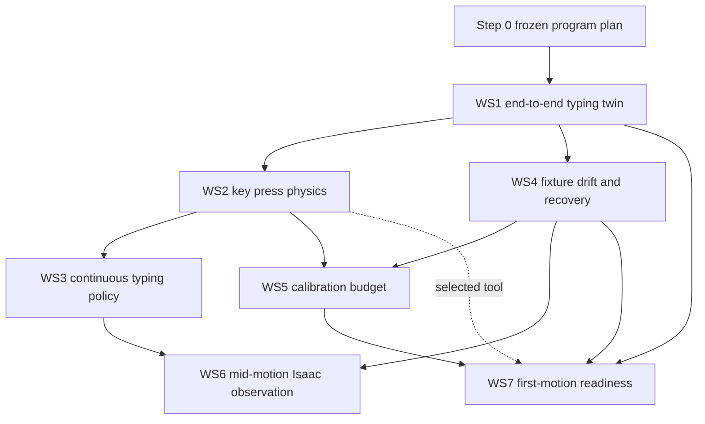

# Tactevra prioritized simulation program

- **Status:** Frozen program plan; simulation only
- **Branch:** `issue/190-isaac-sim-host`
- **Claim:** `891c993a45b38a3e7ef066738af494c26c979b77`
- **Date:** 2026-10-04
- **Owners:** AI/model and simulation lane, with arm/runtime contract review
- **Authority:** None. This plan cannot create a command, execution permit,
  transport payload, controller write, hardware write, or physical movement.

## Program objective

Build a reproducible digital-twin and fault-injection program that connects
intent, deterministic typing semantics, perception evidence, arm planning,
simulated motion and contact, device behavior, and independent effect
verification. The program answers which software contracts work in simulation,
which physical performance ranges appear feasible, and which measurements are
required before any physical claim.

The program does not qualify hardware. Every unmeasured physical quantity is a
declared sensitivity range. Results remain `EXPLORATORY_SIMULATION_ONLY` until
the corresponding physical source is measured and admitted through its own
procedure.

## Mandatory program controls

These controls apply to every workstream and override convenience or speed.

1. Hardware access, writes, movements, controller commands, execution permits,
   transport, and physical authority remain exactly zero.
2. Each workstream begins with a separate claim commit. Its fixture, identities,
   ranges, metrics, decision rules, random seeds, and stop rules are committed
   before execution.
3. Failed or superseded attempts remain hash-bound in external evidence and are
   summarized without rewriting their original outcome.
4. A workstream may not promote a single synthetic value as a measured physical
   constant. Ranges are reported with the sampling design that produced them.
5. Dual-GPU work records each GPU identity, driver, CUDA, Python, MuJoCo,
   MuJoCo Warp, Warp, Isaac, and operating-system version. Numerical payloads
   must match exactly where the same deterministic computation is expected;
   otherwise a predeclared tolerance and reason are required.
6. One compact, hash-bound repository summary and one external manifest are
   preferred per workstream. Raw frames, tensors, trajectories, and simulator
   caches remain external.
7. Every external manifest inventories exact relative paths, byte sizes, and
   SHA-256 values. Completion requires a verified second copy. The backup root
   must be supplied explicitly; if it is unavailable, the workstream reports
   `BLOCKED_BACKUP` rather than claiming completion.
8. Each workstream reports hardware-write count, physical-movement count,
   command count, permit count, transport count, render count, physics-step
   count, training-run count, and physical-authority state.
9. The source-archive check, maintained documentation check, focused tests, and
   `git diff --check` run before every result commit.
10. A later workstream may start early only when every dependency is satisfied,
    its fixture is frozen, and it does not compete for CPU, disk, or GPU capacity
    with a higher-priority run.

## Current no-preemption dependency

The paired 96-versus-192 residual-obstruction comparison was already active
when this program was requested. The observed process is:

```text
run_full_paired_training.py --profile ASSUMED_LOW --workers 8 --maximum-epochs 18
```

No program GPU process may start until that campaign finishes or fails and its
own owner records the outcome. Step 0 planning and CPU-only implementation may
proceed. This program must not terminate, reprioritize, alter, or reuse that
process or its outputs.

## Shared evidence and determinism contract

Each workstream freezes one manifest with:

- program, workstream, schema, commit, fixture, catalog, model, simulator asset,
  and source hashes;
- all random seeds and partition identities;
- physical sensitivity ranges and units;
- selected GPU UUID, driver, runtime, and simulator versions;
- expected output identities and admission rules;
- zero-authority counters; and
- backup source and destination receipts.

Randomized scenarios use a counter-based seed derived from the manifest hash,
scenario identity, and repetition index. CI subsets use a strict subset of the
same identities. Re-running a subset does not create new samples.

Timing is reported separately from correctness. Wall-clock timing is descriptive
unless a workstream explicitly freezes a performance gate. Simulator throughput
cannot be presented as expected hardware throughput.

## Dependency order



Workstreams execute in numerical order. The graph identifies implementation
dependencies; it does not authorize out-of-order GPU execution.

## Workstream 1: end-to-end typing digital twin

### Objective

Create a deterministic, zero-authority closed-loop regression harness from
typed user intent through simulated device effect and independent verification.
It becomes the common fault-injection boundary for later workstreams.

### Questions answered

- Does a valid intent preserve the user's exact requested text?
- Does deterministic compilation preserve semantic target order, repeats,
  punctuation, numbers, and every modifier or phone-layer transition?
- Do perception, fusion, planning, simulated motion, device state, and effect
  verification agree on each committed character?
- Does the system detect an invalid Sticky Keys configuration, phone-layer
  mismatch, autocorrect, predictive text, missing event, duplicate event, wrong
  event, stale observation, or impossible target?
- Can a small CI subset reproduce the full harness semantics and receipt?

### Frozen inputs

- Closed intent schema: `TYPE_TEXT`, `PRESS_KEY`, `CLARIFY`, and `REFUSE`.
- The exact admitted simulation target catalog at workstream freeze. Catalog
  cardinality is never inferred from a renderer or planner output.
- Deterministic keyboard compiler and explicit Sticky Keys state machine.
- Deterministic phone layer machine with letters, shift, numbers, symbols,
  backspace, and enter/action transitions.
- `ModelMotionBatchV2` remains the AI-to-arm boundary. No joint, PWM, serial,
  Waveshare, permit, or transport field is added.
- Analytic target geometry is the default perception mode. A small exact
  allowlist of fixed strings and faults uses retained Isaac-rendered perception
  after the no-preemption dependency clears.
- Existing zero-authority arm-runtime IK and screening interfaces and the
  kinematically consistent MuJoCo model.

### Scenario fixture

The full fixture contains:

- `Hello 2026!` on keyboard and phone;
- every supported printable ASCII character;
- repeated keys, including repeated shifted symbols;
- all lower/upper, upper/upper, symbol/symbol, space-to-shift, trailing-capital,
  phone shift, phone numeric, and phone symbol-layer transitions;
- 10,000 seeded random text payloads for keyboard and 10,000 for phone;
- lengths sampled from the declared set `1, 2, 4, 8, 16, 32, 64, 128` with
  equal identity allocation, plus explicit empty and unsupported cases;
- exact quoted-text preservation cases and ambiguous unquoted requests; and
- an autocorrect/predictive-text-on phone case that must be detected.

The random alphabet is the compiler-supported printable set frozen in the
manifest. Unsupported characters are separate negative tests and may never be
silently substituted.

### Closed-loop stages

```text
intent JSON
  -> exact-text guard
  -> keystroke or phone-layer compiler
  -> ordered semantic targets
  -> analytic or allowlisted Isaac perception
  -> fusion and named-target admission
  -> zero-authority IK and collision screening
  -> MuJoCo kinematic motion receipt
  -> simulated keyboard/phone actuation
  -> simulated host event or screen-state log
  -> independent text/state verification
```

Sticky Keys models latch, lock, unlock, the five-press shortcut, and the
two-key-disable setting. The commissioned simulation profile requires the
five-press shortcut disabled and simultaneous-key disable off. Phone
commissioning requires autocorrect and predictive text off. The required
negative case turns them on and must produce a configuration mismatch rather
than an accepted exact-text result.

### Fault-injection hooks

Named hooks are frozen for: stale frame, stale telemetry, missing target,
target displacement, perception abstention, fusion rejection, unreachable IK,
collision rejection, dropped press, duplicate press, wrong press, delayed
press, Sticky Keys state divergence, phone-layer divergence, autocorrect,
predictive replacement, readback delay, and verification mismatch.

### Outputs

- One deterministic full-run receipt and one CI-subset receipt.
- Per-scenario ordered stage trace with no authority-bearing fields.
- Simulated keyboard event log and phone screen-state/readback log.
- Fault-injection registry consumed by Workstreams 4 and 6.
- Stage-latency distributions and exact failure attribution.

### Metrics

- exact-text success rate;
- schema validity and exact quoted-text preservation;
- semantic-target order and repeat preservation;
- compiler versus simulated OS/device-state disagreements;
- independent verification agreement;
- false acceptance of injected faults;
- per-stage median, p95, p99, and maximum latency; and
- full/CI deterministic receipt agreement on shared identities.

### Pass and stop rules

Pass requires 100% schema validity, zero altered quoted payloads, 100% exact text
for all supported no-fault scenarios, zero target-order differences, zero
compiler/device-state disagreements, 100% independent verification agreement,
and detection of every injected deterministic fault at its declared stage.
Autocorrect-on and predictive-text-on must fail commissioning and must not be
counted as typing failures after admission. Any silent substitution, accepted
state divergence, authority-bearing output, or non-deterministic shared receipt
stops the workstream. Latency is descriptive in WS1 and becomes a policy metric
in WS3.

### Dependencies and compute estimate

Step 0, admitted schemas/catalogs, existing compiler/runtime interfaces, and the
finished 96/192 job are required. CPU implementation and analytic runs are
estimated at 30–90 minutes. The exact Isaac subset is estimated at 15–45 GPU
minutes total. MuJoCo replay is estimated below 15 GPU minutes. The workstream
must benchmark a smoke before scheduling the full subset.

## Workstream 2: key press physics in MuJoCo Warp

### Objective

Build an exploratory contact model that maps landing error and press timing to
key actuation, neighbor contact, repeat behavior, phone tap, and long press.

### Questions answered

- Which press depth, dwell, approach speed, and release speed ranges actuate
  once without neighbor contact or repeat?
- How does fingertip radius change the per-key envelope?
- Which ranges fail first on `GRAVE`, `EQUAL`, `Z`, and `SHIFT`?
- Which phone contact-area and duration ranges separate tap from long press?

### Predeclared physical sensitivity ranges

All values are exploratory until measured:

| Parameter | Range |
|---|---:|
| keycap top width and height | 11–15 mm each |
| key travel | 1–5 mm |
| actuation depth | 30–90% of travel |
| bottom-out depth | 90–110% of declared travel |
| key spring rate | 0.1–2.5 N/mm |
| key damping | 0.001–0.2 N·s/mm |
| compliant-plunger spring rate | 0.0715–0.286 N/mm, derived as 0.5x–2x the unqualified published 0.143 N/mm candidate rate |
| actuation force | 0.2–3.0 N |
| fingertip sphere/capsule radius | 1–6 mm |
| commanded press depth | 0.5–7 mm |
| dwell | 10–750 ms |
| approach speed | 2–120 mm/s |
| release speed | 2–160 mm/s |
| OS repeat delay | 200–1,200 ms |
| OS repeat period | 20–250 ms |
| keyboard switch-closure/debounce minimum | 5-30 ms |
| phone effective contact radius | 1–7 mm |
| phone accepted contact duration | 20–500 ms |
| phone long-press threshold | 250–1,200 ms |

Landing errors use the frozen MW2UC fixed-approach/calibrated-residual ranges,
including 3–4 mm effective regions, random noise `0.001–0.002 rad`, fixed-source
magnitude `0.002–0.008 rad`, and residual fractions `0–0.25` for focused runs.
Broader failure controls retain residual `0.5–1.0`.

### Model and outputs

Each keycap is a prismatic joint with explicit travel, spring, damping,
actuation surface, actuation threshold, and bottom-out. The fingertip is a
sphere and a capsule in separate frozen families. The shared compliant tool is
a spring-loaded plunger in series with the key: commanded depth is partitioned
between plunger compression and key travel under force equilibrium. The
unqualified Lee Spring candidate rate is sampled at 0.5x, 1x, and 2x rather
than treated as measured. Contact events drive a simulated OS repeat model;
they never create real host input.

Stage A reports keyboard results separately for every tool geometry and
compliant-plunger sample. The phone surface models effective contact area and
contact duration only, and its capacitive-tap results are reported separately
so pooling cannot hide a keyboard-versus-phone tip conflict. It does not claim
electrostatic touchscreen accuracy.

Output is a per-key press-recipe envelope over depth, dwell, approach, release,
and fingertip radius, with highlighted limiting results for `GRAVE`, `EQUAL`,
`Z`, and `SHIFT`.

### Metrics

- single-actuation probability and confidence bound;
- partial-press, double-actuation, neighbor-contact, bottom-out, and auto-repeat
  rates;
- peak penetration, peak contact force, compliant-plunger compression, effective
  key travel, dwell above actuation, realized switch-closure duration, debounce
  margin, and release completion;
- phone tap, no-tap, multiple-tap, and long-press rates; and
- per-key robust-envelope volume across the declared physical range.

### Pass and stop rules

The exploratory envelope admits a keyboard cell only when every sampled landing
has one actuation, zero neighbor contact, zero double actuation, zero repeat,
successful release, finite state, no solver overflow, and realized switch
closure of at least every sampled debounce minimum (therefore at least 30 ms)
while remaining at or below the frozen 150 ms hold ceiling. Each recipe reports
realized switch-closure duration. Phone cells require exactly one tap and no long
press. A key with no admitted recipe is reported infeasible; its range is not
widened after results. Nonfinite contact state, penetration beyond the declared
bottom-out tolerance, or cross-GPU disagreement stops the run.

### Dependencies and compute estimate

WS1 actuation/event interfaces, MW2UC landing model, and a frozen contact asset
are required. A power smoke determines shard count. Before physical use, measure
the assembled compliant body's force-versus-travel curve, free travel, return
hysteresis, and effective axial stiffness for every selected tool route. Measure
the selected landing sensor's repeatability and noise near the start of physical
commissioning because WS5 found landing-observation noise drives calibration
effort. Expected compute is 1-4 GPU hours across both RTX 3090s, plus 30-90
minutes for admission and summarization.

## Workstream 3: continuous typing motion policy

### Objective

Evaluate direct key-to-key motion without mandatory parking while preserving a
single approach direction, collision clearance, landing accuracy, and verified
device effect.

### Questions answered

- What speed/accuracy frontier is achievable for direct transitions?
- Which directed key pairs require parking or a higher hover?
- How does continuous typing compare with the parked closed loop?

### Inputs and ranges

- Exact simulation catalog frozen after WS1.
- WS2 press envelopes and fingertip families.
- Every ordered key-to-key pair, including repeated-key self transitions.
- Hover height `2–30 mm`.
- Cartesian transition speed `10–400 mm/s`.
- approach and release speed within the WS2 admitted envelope;
- dwell within the WS2 admitted envelope;
- random noise `0–0.002 rad`;
- constant approach-direction backlash `0–0.008 rad`; and
- per-key residual correction `0–0.25` of the fixed simulated bias.

### Outputs and metrics

Output is a speed-accuracy curve and a pair-policy table selecting direct,
higher-hover, or parked transition for each directed pair. Metrics are verified
characters per minute, miss rate, neighbor-contact rate, collision-screen
rejection rate, path length, transition latency, peak joint speed, and fraction
of pairs requiring park.

### Pass and stop rules

Every admitted transition must pass the existing arm-runtime joint-limit and
collision screens, preserve the single approach direction, remain inside the
selected WS2 landing envelope, and produce exactly one simulated event. No
aggregate rate may hide a failing pair. The recommended exploratory policy is
the fastest policy with zero sampled collision/neighbor contact and with the
predeclared per-pair miss upper bound no worse than the parked reference. If no
continuous class satisfies those rules, the result recommends parking.

### Dependencies and compute estimate

WS1 and WS2 must complete. Expected Warp compute is 2–8 GPU hours depending on
catalog cardinality and power analysis. CPU collision admission and summary are
estimated at 1–3 hours.

## Workstream 4: fixture drift and recovery

### Objective

Use WS1 fault hooks to measure detection and recovery for displaced fixtures
and incorrect simulated device effects.

### Questions answered

- How quickly does the closed loop detect drift or a wrong effect?
- How many incorrect characters can be committed first?
- Which faults can be corrected by re-observation or backspace, and which must
  abort?

### Inputs and ranges

- Keyboard and phone translations independently swept over `±1–10 mm` in X/Y.
- In-plane rotation `±0.25–5 degrees`.
- Single and burst missed presses, wrong keys, and double presses.
- Observation/readback delay `0–2 seconds`.
- Drift onset before planning, during travel, immediately before contact, and
  after effect verification.

### Recovery state machine

```text
OBSERVE -> PLAN -> SIMULATE_PRESS -> VERIFY
   |          |          |            |
   +--STOP----+----------+------------+
                     mismatch
                        |
          REOBSERVE -> RELOCALIZE
                        |
          unchanged? retry once : abort/replan
                        |
           wrong committed text -> verified backspace correction
```

Backspace correction is allowed only after readback identifies the exact wrong
effect and the correction itself is independently verified. Ambiguous state
aborts.

### Metrics and decision rules

Metrics are detection latency, committed wrong characters before detection,
relocalization success, correction success, abort correctness, attempts, and
total recovery time. Pass requires every injected deterministic fault to be
detected, no ambiguous state to continue, no more than one wrong character
before detection under per-character verification, and at least 99% recovery
success for faults declared recoverable by the frozen fixture. False recovery
or continuing after an ambiguous readback stops the workstream.

### Dependencies and compute estimate

WS1 must complete; WS2 recipes are used when available but are not required for
state-machine unit tests. Expected CPU time is 30–120 minutes and optional Warp
replay is 15–60 GPU minutes.

## Workstream 5: calibration procedure budget

### Objective

Estimate how many per-key probes are needed to reduce fixed landing bias to the
MW2UC 10–25% residual range and how frequently recalibration would be needed
under a declared drift range.

### Questions answered

- How many probes per key meet the residual target with conservative coverage?
- What total commissioning time follows from the selected probe count?
- Which drift rates imply hourly, daily, or session-based recalibration?

### Inputs and ranges

- Probe counts `1, 2, 3, 5, 8, 13, 21, 34` per key.
- Landing-observation noise `0.1–2.0 mm`.
- Outlier probability `0–5%` with bounded `1–5 mm` magnitude.
- Fixed landing bias corresponding to MW2UC source ranges.
- Linear translational drift `0.01–0.5 mm/hour`.
- rotational drift `0.01–0.25 degree/hour`.
- Session duration `0.25–8 hours`.
- Residual target `10%, 15%, 20%, 25%` of initial fixed landing bias.

### Outputs and metrics

Output is a probe-count table per target family, total commissioning-time range,
and recalibration policy indexed by measured drift. Metrics are residual-bias
coverage, confidence-interval width, outlier rejection, probe failures, total
press count, elapsed simulated commissioning time, and time until the selected
safe-region margin is consumed.

### Pass and stop rules

A probe count is admitted only when the predeclared confidence bound covers the
target residual for every key. The recalibration interval uses the earliest
time any key's conservative margin is exhausted. If no probe count through 34
meets the target, the workstream reports that physical calibration method as
insufficient. It does not relax the target or extrapolate beyond the grid.

### Dependencies and compute estimate

WS2 supplies contact-valid probes; WS4 supplies detection/relocalization
semantics. Expected compute is CPU dominated, 30–120 minutes, with less than 30
GPU minutes for optional Warp validation.

## Workstream 6: mid-motion observation in Isaac

### Objective

Render the arm along WS3 trajectories and determine whether target observation
can be admitted while the arm remains in view, without confusing arm-covered
regions with visible targets.

### Questions answered

- Does projected arm geometry conservatively cover the rendered arm mask?
- Which targets remain observable at each trajectory phase?
- Does 9 fps exposure blur invalidate the uncovered-region obstruction check?

### Inputs and ranges

- Frozen WS3 trajectories and pair-policy identities.
- Frozen exact-nadir camera family at 700, 850, and 1,000 mm.
- Frame rate fixed at 9 fps for the primary family.
- Exposure duration `1/120, 1/60, 1/30, 1/15, 1/9 second`.
- Joint-state/capture timestamp offset `0–111 ms`.
- Projection dilation derived only as a range from the unmeasured MW2UC joint
  profiles; it is never installed as a physical margin.
- Held-out simulator audit masks disjoint by trajectory, lighting appearance,
  and camera identity from any development tuning.

### Method and outputs

Isaac renders RGB, motion vectors, depth, semantic arm masks, and target masks.
The analytic arm silhouette uses capture-time joint state. Positive arm-mask
overlap is required in the fixture. The obstruction check runs only for target
safe-region pixels outside the dilated projected silhouette; covered targets
must abstain.

Output is a simulation-only mid-motion gate receipt, per-phase observable-target
map, mask-overlap diagnostics, and failure examples. Physical mid-motion use
remains blocked regardless of result.

### Metrics and pass/stop rules

Metrics are projected-mask recall and precision against held-out masks,
safe-region uncovered fraction, covered-target false-clear count, uncovered
obstruction miss/false-stop rates, blur-stratified results, and timestamp-offset
sensitivity. Pass requires positive overlap cases, zero covered-target false
clear, every tested target classified covered or evaluated, held-out projected
mask recall lower bound at least 99%, and the separately frozen residual
obstruction limits on uncovered pixels. Any skipped covered target, source-mask
leakage, or use of perfect simulator masks as runtime inputs stops the gate.

### Dependencies and compute estimate

WS3 trajectories and WS4 recovery behavior must be frozen. Estimated Isaac
render time is 3–10 GPU hours after a smoke-derived throughput estimate;
evaluation and mask scoring are estimated at 1–3 CPU hours. Isaac work never
runs while a higher-priority GPU campaign is active.

## Workstream 7: first-motion readiness

### Objective

Build a CPU-first rehearsal and evidence package for a future staged hardware
bring-up while preserving zero transport and zero physical authority. The
workstream exercises the exact controller encoding boundary against a guarded
software emulator, predicts telemetry envelopes for stages A-F, tests whether
wrong models and controller faults are detected before simulated contact, and
collects all results in a scenario regression library and human-controlled
readiness checklist.

Simulation results from this workstream cannot authorize a powered session.
The first powered motion requires Jack's explicit approval after the applicable
physical measurements and checklist items are complete.

### Questions answered

- Does the real runtime encoder round-trip the intended joint, sign, magnitude,
  unit, controller ID, and zero convention through an isolated emulator?
- Can emulator mode prove that serial and every other real transport are
  unreachable?
- What measured-position telemetry envelopes should stages A-F produce across
  predeclared latency, response, encoder, backlash, and noise ranges?
- Which wrong-model, controller, environment, and human-entry conditions stop
  before simulated contact, and which remain detection gaps?
- Which exact simulation artifacts and physical measurements are prerequisites
  for each future hardware stage?

### Frozen implementation phases

#### Phase 2 - controller emulator

The emulator accepts only bytes or typed messages emitted by the repository's
existing runtime encoder and controller contract. Servo IDs, message format,
units, direction, and zero convention are derived from those sources. An
undocumented field becomes a named assumption requiring later controller
confirmation; it is never silently guessed.

The real runtime path runs end to end with only the physical transport replaced
by a guarded in-memory transport. A hard guard plus a negative test must prove
that emulator mode cannot import, enumerate, or open a serial port, socket,
device file, or real controller transport.

Unmeasured servo properties remain sampled ranges: command latency, response
lag and settling, encoder resolution, direction-dependent backlash, measured
position noise, and overload or stall behavior. Telemetry reports simulated
measured position rather than echoing commanded position. Fault hooks cover a
dropped message, delayed telemetry, nonresponding servo, stall or overload,
e-stop, and power interruption.

#### Phase 3 - staged bring-up rehearsal

The deterministic stage sequence is:

1. A: one joint, small displacement, low speed;
2. B: all joints to the parked pose;
3. C: noncontact hover above the keyboard;
4. D: one simulated press on a test pad;
5. E: one simulated character; and
6. F: one simulated short string.

Each stage emits a hash-bound predicted telemetry envelope containing joint
position over time, measured-position uncertainty, tool-tip position, collision
and limit diagnostics, expected device effect, and verification result.
Exploratory tolerances are ranges fixed before rehearsal. A stage stops on
wrong direction, magnitude outside its envelope, pose mismatch, collision or
limit warning, landing outside its envelope, wrong simulated key, or any
verification disagreement.

#### Phase 4 - wrong-model drills

Drills inject one condition at a time and declared pairs: link-length error
`1-3 mm`, joint-zero error `0.5-2 degrees`, flipped joint sign, swapped servo
IDs, degree/radian confusion, keyboard translation `2-10 mm`, keyboard rotation
`1-3 degrees`, stale telemetry, dropped connection, and delayed telemetry.
Each receipt records whether detection occurred, the first detecting mechanism,
the first affected stage, and whether detection preceded simulated contact.
An undetected condition is retained as a gap with a proposed new detection
mechanism. No tolerance changes after drill results; any amendment starts a new
pre-result fixture revision.

#### Phase 5 - scenario library and regression runner

One scenario catalog gives every case an ID, category, preconditions, injected
condition, expected outcome (`PROCEED`, `ABSTAIN`, `RETRY`, or `STOP`), and
expected detection mechanism. Categories cover nominal long strings, repeats,
modifier and phone-layer transitions; `GRAVE`, `EQUAL`, `Z`, `SHIFT`, joint
limits, and reach extremes; all controller faults; fixture shift, obstruction,
lighting change, and stale references; hand entry; and every wrong-model drill.
The runner composes the WS1 fault hooks and WS4 recovery machine and exposes a
fixed fast CI subset plus a full nightly identity set.

#### Phase 6 - readiness checklist

`software/docs/FIRST_MOTION_READINESS.md` lists, for stages A-F, the required
simulation artifact hashes, physical measurements, no-go criteria, abort
procedure, and explicit human approval. Every item is labeled satisfied,
blocked on simulation, or blocked on physical measurement. The checklist
records status; it cannot create an execution permit or authorize transport.

### Inputs and parameter ranges

- Existing runtime command encoder, controller contract, joint map, unit and
  frame contracts, pinned URDF, collision kernel, and simulator-only transport.
- WS1 semantic twin and fault hooks; WS4 recovery state machine; WS5 calibration
  findings; candidate collision intake retained only as exploratory evidence.
- Servo latency, lag, settling, resolution, backlash, noise, speed, acceleration,
  and overload thresholds are fixture ranges derived from repository bounds or
  explicitly labeled assumptions. No range endpoint becomes a nominal hardware
  constant.
- Stage displacement, speed, duration, and telemetry tolerance are separately
  frozen ranges. Phase 2 does not begin until these ranges, protocol bindings,
  random seeds, fault identities, metrics, and stop rules are hash-bound.
- WS2 may later replace the provisional contact tool. Any replacement creates a
  new collision-candidate and telemetry-envelope revision rather than rewriting
  prior evidence.

### Outputs

- A transport-isolated controller emulator and exact encoder/decoder conformance
  receipt.
- Per-stage A-F scripts and predicted telemetry-envelope artifacts.
- A wrong-model drill matrix with precontact-detection results and retained gaps.
- A versioned scenario catalog, fast CI runner, full nightly runner, and
  category-level summary.
- `FIRST_MOTION_READINESS.md` with artifact hashes and physical dependencies.
- One compact external evidence manifest and verified backup inventory per
  phase, including zero-authority counters and exact environment versions.

### Metrics

- Exact command-byte acceptance and round-trip field agreement by joint.
- Servo-ID coverage, sign, magnitude, unit, and zero mismatches, plus false
  telemetry agreement between commanded and simulated measured state.
- Transport-open attempts, all of which must remain zero.
- Stage envelope coverage, limit or collision warnings, predicted landing error,
  device-effect agreement, and verification agreement.
- Fault and wrong-model detection rate, first-detection stage, precontact
  detection rate, and undetected-gap count.
- Scenario pass rate and false acceptance by category; recovery success and
  wrong characters committed before detection.
- Hardware writes, physical movements, real commands, permits, transports, and
  physical authority, all required to remain zero.

### Pass and stop rules

Phase 2 passes only with 100% exact protocol round-trip across every joint and
the all-joint message, correct measured-position telemetry semantics, detection
of every deterministic controller fault, and zero real-transport opens. Any
undocumented protocol detail is a blocker for the affected claim.

Phase 3 passes only when each stage remains inside every frozen envelope and
produces the expected independent simulated effect. A later stage cannot run
after an earlier no-go result. Phase 4 reports gaps rather than claiming pass
when any drill reaches simulated contact before detection. Phase 5 requires the
fixed CI and full identity sets to match their declared outcomes with zero false
acceptance. Phase 6 is complete only as a checklist artifact; every physical
measurement and human-approval row remains blocked until supplied outside this
simulation program.

Any serial, socket, or device open; real controller discovery; hardware write;
physical movement; command or permit creation; transport authorization; silent
protocol guess; post-result tolerance change; or physical-readiness claim stops
the workstream and preserves the attempt as failed evidence.

### Dependencies and compute estimate

Phases 2-5 are CPU-only and may proceed while the no-preemption residual job
runs. Phase 3 consumes Phase 2; Phase 4 consumes the unchanged Phase 3
envelopes; Phase 5 consumes Phases 2-4 plus WS1 and WS4 hooks; Phase 6 summarizes
all preceding evidence. WS2's later nominal tool selection triggers a bounded
artifact revision. Estimated CPU time is 1-3 hours for emulator implementation
and tests, 1-4 hours for staged and wrong-model sweeps, and under 1 hour for
catalog regression and checklist generation. No GPU allocation is required.

## Ordered successor amendment — 2026-10-05

Before any successor results, the immediate sequence is frozen as:

1. execute the explicit 110 mm total-length, 3 mm-radius keyboard profile;
2. run a bounded release-timing matrix with complete reset and an upper dwell
   limit below every sampled OS auto-repeat delay;
3. run WS2 Stage A and later refinement with compliant-plunger stiffness as a
   declared range, reporting keyboard outcomes by tool geometry;
4. report phone capacitive tap/long-press outcomes separately and use them only
   to decide whether one simulated contact geometry remains plausible;
5. continue to WS3 continuous typing; and
6. execute WS4 recovery tests.

The release matrix precedes the large search so an episode that is too short to
observe reset, or a dwell long enough to create OS repeat, cannot silently
distort Stage A. The existing failed short-release evidence remains unchanged.

The priority physical measurement queue is: servo repeatability/backlash; chosen
landing-sensor noise from the ADB touchscreen or tray touch pad; compliant tool
spring rate/force-travel behavior together with fingertip radius and compliance;
keyboard switch/controller debounce and received USB-event latency;
key travel/actuation force; phone minimum conductive contact area; and B0477
intrinsics, delivered-frame noise, lighting, and board/arm calibration.

The 26,790,912-world compliant Stage A applies the existing frozen throughput
rule. If projected two-GPU wall time is at most 12 hours, Stage A uses all six
stiffness/travel combinations. Otherwise Stage A uses the four range corners
(17,860,608 worlds), and Stage B deterministically adds both omitted nominal
stiffness combinations for every detected boundary identity using all 64
landings. Throughput cannot change safety gates or select favorable outcomes.

## Long-term intent-to-typing campaign ladder — 2026-10-06

This ladder turns the workstreams above into an ordered collection program. It
exists so a successful local experiment cannot be mistaken for end-to-end
readiness and so every retained result has an explicit consumer. It is a
planning amendment, not a fixture amendment: exact populations, thresholds,
seeds, split identities, and compute budgets are frozen in each campaign's own
pre-result manifest after its predecessors finish.

The ladder has one end condition:

```text
supported user request
  -> exact grounded intent
  -> deterministic ordered targets
  -> qualified observations and ModelMotionBatch
  -> fresh-state deterministic motion planning
  -> collision-screened transition and admitted contact
  -> independently observed device effect
  -> verified next action or fail-closed stop
```

The learned components may interpret intent, locate targets, assess the scene,
and abstain. They never create joints, PWM, serial or controller JSON, permits,
transport fields, or physical authority. Motion, contact policy, verification,
and retry decisions remain deterministic runtime responsibilities.

### Campaign sequence

The formal title is the stable human-facing name. The subtitle states the one
question the campaign exists to answer. Use the ID in filenames, manifests,
evidence headings, backup paths, and status reports; do not shorten or renumber
it after evidence exists.

| ID | Formal title | Tracking subtitle | Current planning state |
|---|---|---|---|
| `C00` | Contract and Semantic Baseline | Define exactly what the AI may propose and what the deterministic runtime may accept. | `BASELINE_AVAILABLE_REVISION_CONTROLLED` |
| `C01` | Key Contact Search | Find a one-press mechanical envelope across every supported keyboard target. | `COMPLETE_FAIL_RETAINED` |
| `C02` | Contact Boundary Refinement | Turn the broad contact search into robust recipe windows around every observed boundary. | `COMPLETE_ROBUST_UNIVERSAL_SIMULATION_ONLY` |
| `C03` | All-Pairs Motion Qualification | Move safely between every ordered key pair while preserving the admitted contact envelope. | `BLOCKED_C02_C03_TOOL_IDENTITY_MISMATCH` |
| `C04` | Intent Robustness and Exact-Text Assurance | Understand varied offline instructions without changing, inventing, or prematurely executing requested text. | `READY_FOR_PREIMPLEMENTATION_FIXTURE` |
| `C05` | Closed-Loop String Simulation | Compose intent, observation, motion, contact, device effect, and verification into exact strings. | `BLOCKED_ON_C02_C03_C04` |
| `C06` | Drift, Fault, and Recovery Qualification | Detect divergence, correct only independently known effects, and stop on ambiguity. | `DESIGN_PROVEN_EXPLORATORY_BLOCKED_ON_C05` |
| `C07` | Vision and Obstruction Simulation | See targets conservatively across camera height, lighting, robot overlap, and unexpected obstruction. | `EXPLORATORY_COMPONENTS_AVAILABLE` |
| `C08` | Physical Measurement and Camera Qualification | Replace simulated assumptions with one measured and held-out installed-workcell evidence epoch. | `BLOCKED_ON_INSTALLED_HARDWARE` |
| `C09` | Simulation-to-Reality Correlation | Measure where the digital twin predicts the installed workcell and where it does not. | `BLOCKED_ON_C08` |
| `C10` | Full Zero-Write Integration | Prove the complete request-to-verification software chain without producing hardware effects. | `BLOCKED_ON_C04_THROUGH_C09` |
| `C11` | S5 Single-Action Physical Qualification | Perform one separately authorized and independently verified physical key action. | `BLOCKED_ON_C10_AND_PHYSICAL_APPROVAL` |
| `C12` | S6 Short Typing Missions | Build from repeated keys and two-key transitions to exact mixed short phrases. | `BLOCKED_ON_C11` |
| `C13` | S7 Operational Qualification | Establish bounded real-world performance, drift, recovery, and readiness across independent sessions. | `BLOCKED_ON_C12` |

These campaign states are planning labels, separate from the shared stage-board
status vocabulary. A state update records scheduling and dependencies; it does
not advance an AI lane, arm lane, integration gate, or physical authority.

#### Campaign definitions

| Campaign | Purpose and retained population | Entry condition | Exit evidence and failure branch |
|---|---|---|---|
| `C00-contract-baseline` | Bind the closed intent schema, exact-text guard, 51-key semantic catalog, phone layer machine, `ModelMotionBatchV2`, frame and calibration identities, zero-authority counters, and independent-effect interface. Retain punctuation, numbers, repeated targets, capitals, shifted symbols, ambiguity, unsupported characters, and stale-evidence negatives. | Current shared schemas and compiler are available. | Schema validity and exact target replay are deterministic. Any altered quoted text, inferred unsupported key, target reordering, or authority-bearing field stops downstream campaigns. This baseline exists; successors bind its current hashes rather than copying assumptions. |
| `C01-contact-search` | The completed WS2 Stage A population: 51 targets, mechanism profiles, tool tips, landing scenarios, recipes, landing samples, and compliance combinations, totaling 26,790,912 simulated presses. It retains actuation, hold, repeat, bottom-out, neighbor contact, force, release, and two-sided depth margin for every row. | Positive press and release controls, debounce contract, target-specific neighborhoods, dual-GPU smoke, operational preflight, supervisor fault matrix, and independent backup passed. | The retained result is `COMPLETE_INFEASIBLE_NO_RANGE_CHANGE`: 0 complete scenario cells and 0 robust cells. C01 remains immutable; its transition evidence feeds C02 without rescoring or gate changes. |
| `C02-contact-boundary-refinement` | WS2 Stage B reruns only the hash-bound C01 transition identities at all 64 landings, preserving target, scenario, profile, tip, compliance, and recipe. The exact fixture contains 8,568 three-scenario recipe families, 1,122 homogeneous shards, and 1,645,056 worlds. Stabilized keys remain target-specific and phone capacitive contact remains separate. | C01 is finalized; the bounded extractor, exact manifest, supervised preflight, local/F custody, and 26 cross-GPU sentinels pass. | Complete in simulation: 180 robust target-specific families cover all 51 targets, and recipe signatures 80 and 75 with `travel_mm__LOW`, `capsule-r6-m2`, and `k0.286_t6` are universal across 51/51 targets. Recipe 80 ranks first with 0.040833 mm minimum simulated depth margin. Physical tool compliance, key travel, force, and positioning remain unqualified, so this result grants no recipe or execution authority. |
| `C03-all-pairs-motion` | Bind the C02 recipe and tool identity to all 51 x 51 ordered transitions, including same-key repeats. Evaluate source release, rise, transit, destination descent, reorientation, IK, limits, swept robot/tool/workcell collision, landing envelope, and expected timing. | Blocked at the exact identity gate: C02 recipe 80 is universal only with a 6 mm-radius capsule, while the prepared and previously feasible C03 geometry is a 3 mm distal tip. No envelope was emitted and no pair was screened. Next predeclare a bounded 3 mm contact bridge around recipes 80/75, preserving every C02 failure gate. | Produce a per-pair policy of direct, higher-hover, parked, or infeasible, with no hidden failing pair. Any missing recipe, geometry mismatch, collision, joint-limit violation, or landing-envelope breach remains a stop. |
| `C04-semantic-and-intent-robustness` | Expand the held-out language campaign around exact `TYPE_TEXT`, `PRESS_KEY`, `CLARIFY`, and `REFUSE` behavior. Keep literal user payloads separate from paraphrase templates. Include ambiguity, negation, corrections, multiple clauses, unsupported devices or characters, prompt-injection-shaped text, and long strings. Compare the deterministic grounded parser with any small offline language-model candidate. | C00 remains stable; this CPU/model campaign may prepare while C01-C03 run but cannot claim motion readiness. | Require 100% schema validity, zero altered accepted text, zero false executable intent on the frozen safety set, exact deterministic compilation, and explicit abstention on unresolved requests. A language model may improve coverage only if the same hard rules remain satisfied. |
| `C05-closed-loop-string-simulation` | Re-run WS1 using actual C02 contact and C03 transition policies. Cover every printable supported character, repeated keys, Sticky Keys state, phone layers, seeded strings across frozen length bands, and deliberate wrong, missed, or double events. Retain the semantic trace, target sequence, `ModelMotionBatch`, planned transition class, contact result, simulated device log, and verifier decision. | C02, C03, and C04 outputs are bound; the actual batch and ingress contracts pass their shared boundary tests. | Supported no-fault strings must reproduce exactly and every deterministic injected fault must be detected at the declared stage. A sent or simulated command is never scored as a successful character without independent effect evidence. |
| `C06-recovery-and-drift` | Re-run WS4 with the C02/C03 policies and C05 string missions. Inject fixture translation or rotation, stale observations, readback delay, missed, wrong, or double effects, ambiguous outcome, and changing phone state. | C05 produces exact closed-loop traces. | Show bounded `STOP`, `REOBSERVE`, `RELOCALIZE`, verified correction, or `ABORT` behavior. Automatic physical retry remains forbidden after ambiguous dispatch or outcome. Existing exploratory recovery evidence supplies the design; this campaign proves the bound policy composition. |
| `C07-vision-and-obstruction-simulation` | Bind parked-camera geometry, projected robot silhouette, reference-difference residual observer, target-safe regions, camera-height family, obstruction assets, lighting mismatch, crop convention, and simulated delivered camera format. Include held-out targets, obstruction assets, lighting appearances, intermediate camera heights, and positive robot-mask overlap. | Camera-independent simulator contracts are frozen; measured B0477 parameters are not yet required for exploratory execution. | Report localization, uncertainty, abstention, covered-target false clears, residual obstruction misses or false stops, and hard-case families. The result remains simulation only. Missing real noise, tone, lighting, and calibration are blockers rather than guessed deployment constants. |
| `C08-physical-measurement-and-camera-qualification` | Freeze one installed configuration epoch and collect ChArUco intrinsics, distortion, camera-to-board and board-to-robot transforms, delivered frame mode, tone response, brightness-dependent and spatially correlated noise, locked exposure, gain and focus, lighting drift, fixture repeatability, tool force/travel, key travel/force/debounce, servo backlash/repeatability, landing-sensor noise, and real clear/obstructed references. Escrow a disjoint real evaluation subset before tuning. | The final camera, arm base, board, keyboard, tool, cables, and lighting are fixed. Physical procedures and custody manifests pass; the arm remains de-energized for capture work unless a later separately authorized procedure says otherwise. | Install only measurement profiles with complete identities and uncertainty. Held-out real localization and obstruction results may qualify the AI observation lane; a small sanity set cannot estimate operational error rates. Any configuration change starts a new epoch. |
| `C09-sim-to-real-correlation` | Replace unmeasured ranges with C08 profiles and compare predicted versus observed camera, landing, tool-compliance, and key-effect behavior. Preserve original synthetic results and produce correction factors or narrower measured domains without rewriting them. | C08 measurement and escrow rules are complete. | Determine which simulator findings transfer, which need a successor model or corpus, and which require a physical workcell rule. A simulator mismatch blocks affected physical capability and creates a newly versioned campaign. |
| `C10-full-zero-write-integration` | Replay held-out supported requests through intent, vision, precision observation, `ModelMotionBatch`, strict ingress, fresh state, calibration, IK, collision screening, controller encoding/emulation, device model, recovery, and independent verification. Exercise wrong model, stale state, obstruction, unreachable targets, identity drift, and ambiguous outcome. | C04-C09 produce bound artifacts. The controller transport is hardware-incapable and hardware-write count remains zero. | Require exact lineage, zero unsafe acceptance in the frozen set, correct stage attribution, deterministic stop behavior, and zero hardware writes, movements, permits, or real transports. This is the final software rehearsal, not physical qualification. |
| `C11-S5-single-action` | Under the existing attended procedure and separate human approval, progress from one sparse noncontact hover to one independently verified key action. Start with the target having the best measured margin; separately prioritize `GRAVE` landing accuracy and `EQUAL` joint-range evidence during calibration. | C10 passes, installed geometry and safety checks are current, the exact attempt package is reviewed, and explicit per-attempt physical authorization exists. | One verified effect with complete telemetry and independent host input evidence advances only the tested capability. Any ambiguity, unexpected contact, stale evidence, or envelope breach stops the session and preserves evidence. |
| `C12-S6-short-missions` | Execute a predeclared ladder: repeated same key, two-key transition, lowercase word, mixed case, digits, punctuation, and a short quoted phrase. Each action requires fresh achieved state; each observed effect must match before the next action. | C11 passes for the same configuration epoch and every required target and transition has measured qualification. | Produce exact requested text with no unverified continuation. Failed or ambiguous missions do not silently retrain, alter thresholds, or auto-retry. |
| `C13-S7-operational-qualification` | Measure held-out mission success, unsafe acceptance, abstention, verified characters per minute, recovery, latency, thermal behavior, drift, recalibration interval, and evidence durability across independent sessions and declared operating conditions. | C12 passes and the evaluation population, confidence method, and operational limits are frozen before results. | Operational readiness requires every shared S7 gate and explicit review. Passing this campaign does not expand capability beyond its declared device, targets, environment, and configuration epoch. |

The phone path shares C00, C04, C06-C10, and the observation contracts. Its
contact, layer-state, ADB verification, and physical qualification populations
remain separate from keyboard results. A keyboard recipe cannot qualify a
phone tap, and a phone screen-state result cannot qualify a keyboard press.

### What every campaign collects

Every scenario row or compact aggregate must remain traceable to these groups:

1. **Request identity:** original request bytes or a privacy-safe content hash,
   quoted payload, parsed intent, clarification or refusal reason, compiler
   profile, and exact ordered semantic targets.
2. **Observation identity:** frame and reference hashes, capture time, camera and
   domain IDs, target catalog, calibration/configuration epoch, scene/precision
   observations, uncertainty, visibility, obstruction, and abstention reason.
3. **Planning identity:** `ModelMotionBatch` and plan hashes, target/frame units,
   fresh observed start state, tool/TCP, geometry, IK, transition class,
   collision screen, and deterministic admission or rejection reason.
4. **Dynamics identity:** simulator and asset versions, seed, world/scenario ID,
   recipe, tool/compliance/mechanism parameters, trajectory samples, contacts,
   forces, key travel, hold/release timing, and failure classification.
5. **Outcome identity:** requested effect, simulated or observed device effect,
   independent verifier evidence, recovery decision, completion state, and any
   committed wrong effects before detection.
6. **Custody identity:** full Git SHA, source and fixture hashes, model/checkpoint
   SHA-256, exact command, environment, device or GPU identity, split and seed,
   output manifest, backup receipt, limitations, and next dependency.
7. **Authority counters:** hardware writes, physical movements, real commands,
   permits, transports, and physical authority. Simulation and zero-write
   campaigns require all six to remain zero.

Videos and rendered mosaics are illustrative derivatives. They bind sampled
world IDs and result hashes but never replace numeric receipts, independent
effect evidence, or campaign admission.

### Dataset and model-use discipline

- Training, development, evaluation, and physical-qualification identities are
  disjoint and declared before use. A consumed evaluation set is never reopened
  for model or threshold selection.
- Synthetic and physical scope remain separate fields. Synthetic data may train
  a candidate and locate hard cases; only held-out physical evidence can qualify
  an installed camera or workcell.
- Failed campaigns remain available as negative and diagnostic evidence. They
  may inform a successor predeclaration but are never relabeled as passing.
- Simulation rows may train perception or abstention models only when their
  rendered inputs match the declared runtime representation. Ground-truth masks,
  poses, or physics state unavailable at runtime are labels, never model inputs.
- Motion recipes, collision policy, retry policy, and execution authority are
  not learned targets. The deterministic runtime consumes learned observations
  and decides whether a motion can proceed.
- Any new model is compared with a deterministic baseline and the last admitted
  candidate. Promotion requires the campaign's safety gates, not merely a better
  pooled score.

### Concrete end-to-end mission example

For a request such as `type "Hi!" on the keyboard`, the completed system must
retain and verify this chain:

1. The intent layer emits `TYPE_TEXT` with literal payload `Hi!` and device
   `keyboard`, or abstains. It cannot rewrite the text.
2. The deterministic compiler expands the exact Sticky Keys sequence using only
   commissioned catalog targets; it preserves target order and repetitions.
3. The vision lane binds fresh scene and precision observations to exact frame,
   reference, camera, catalog, calibration, and configuration identities.
4. The AI lane emits one ordered `ModelMotionBatch` proposal per movement action
   at named target coordinates with uncertainty. It emits no joints or commands.
5. The runtime admits one action at a time from fresh achieved state, selects an
   allowed C03 transition, screens IK, limits, and collision, and applies the
   admitted C02 contact recipe.
6. The keyboard host independently reports the received effect. Only the exact
   expected effect advances the next action; mismatch enters C06 recovery or
   stops.
7. Completion means the independently observed text is exactly `Hi!`, with the
   full request-to-outcome lineage retained. A generated trajectory, controller
   receipt, or key-down prediction alone is not completion.

### Scheduling rule

Prepare code and pre-result fixtures for a successor while a long campaign runs
only when doing so cannot change or compete with the active campaign. Launches
remain dependency ordered. At the current checkpoint, C01 is the critical path;
C03 cannot execute without a C02 recipe, while C04 fixture preparation and
documentation may proceed on CPU without using C01 outputs. C07 exploratory
preparation may continue, but C08-C13 remain blocked on installed physical
measurements and their respective predecessor gates.

### Required implementation packet for every campaign

A campaign moves from a planning state to implementation only when one
pre-result packet answers all of the following. Unknown physical values remain
explicit dependencies or sampled sensitivity ranges.

1. **Charter:** stable ID, title, subtitle, owner, objective, decision the result
   will support, non-goals, authority boundary, and predecessor evidence.
2. **Lineage lock:** full Git SHA and exact hashes for schemas, catalogs,
   calibration/configuration epoch, models, simulator assets, runtime sources,
   and every predecessor receipt consumed.
3. **Population design:** row identity, factor axes, units, ranges, controls,
   failure injections, split construction, seeds, sample or power rationale,
   and rules preventing train/development/evaluation leakage.
4. **Implementation inventory:** modules to add or change, fixture and schema
   paths, focused tests, command entry points, external run root, backup root,
   expected compact repository artifacts, and paths explicitly out of scope.
5. **Decision contract:** primary safety quantities, diagnostics, confidence or
   uncertainty method, per-family reporting, pass, fail, block, early-abort,
   amendment, and successor-trigger rules frozen before results.
6. **Controls and smoke:** positive and negative controls, deterministic replay,
   cross-device comparison where applicable, visual/numeric audit sample,
   known-bad fixture, and proof that a deliberately clear success can pass.
7. **Operations:** throughput smoke, projected time and storage, resume proof,
   disk floor, thermal ceiling, watchdog, classified retry policy, backup
   cadence, status file, interruption behavior, and cleanup or retention plan.
8. **Admission:** exact allowlist, count and identity checks, source and fixture
   hash verification, finite-value rules, duplicate/missing output detection,
   backup hash reconciliation, and explicit rejection of stale artifacts.
9. **Result package:** exact command, environment, artifacts and SHA-256 values,
   population counts, metrics, failures and abstentions, limitations, authority
   counters, evidence-ledger entry, workplan update, and next dependency.
10. **Review boundary:** what a pass proves, what remains unproven, which result
    can be used for training or selection, and which held-out evidence becomes
    consumed and unavailable for later tuning.

The implementation packet is intentionally reusable. Later iterations should
normally change code, fixtures, assets, or measured inputs inside this planned
shape. A material change to the objective, population, safety metric, or
authority boundary creates a named successor campaign instead of silently
changing the active one.

### Near-term implementation packets

The following work is defined far enough to begin implementation as soon as its
named dependency clears. Exact successor thresholds are still frozen in the
campaign fixture before results.

#### C01 — Key Contact Search

**Subtitle:** Find a one-press mechanical envelope across every supported
keyboard target.

- Finish the existing supervisor population without modifying its fixture or
  bound source.
- Finalize only after every expected shard is present, admitted by exact
  identity, reconciled to the F backup, and covered by scheduled cross-GPU
  comparisons.
- Aggregate by target, mechanism class, tool tip, landing scenario, recipe,
  landing sample, and compliance point. Report actuation, debounce hold,
  release, repeat, bottom-out, force, neighbor contact, and both depth margins.
- Preserve every failed recipe. Select nothing if any required target or
  mechanism lacks an admitted family.
- Produce post-run deterministic replay videos only from sampled result IDs;
  verify replay outcomes before rendering and keep video illustrative.

#### C02 — Contact Boundary Refinement

**Subtitle:** Turn the broad contact search into robust recipe windows around
every observed boundary.

- Input is the immutable C01 manifest and summary, never a hand-selected list.
  A deterministic extractor identifies pass/fail boundaries and limiting
  target/mechanism families.
- Freeze denser samples around depth, dwell, approach/release speed, compliance,
  tool tip, and landing error only where C01 predeclared Stage B refinement.
- Retain positive controls, release controls, stabilized-key classes, debounce
  limits, two-sided depth margin, and all original failure conditions.
- Implement a compact fixture generator, shard runner, admission/finalizer,
  boundary visualization, and focused tests for identity drift, omitted failures,
  unsafe post-result widening, and deterministic replay.
- Exit with a versioned exploratory recipe family plus its valid target and
  mechanism domain, or a named design blocker. Phone contact stays separate.

##### C02.1 — Exact 3 mm Contact Bridge

The first frozen bridge attempt remains failed evidence. Its dual-GPU smoke
stopped before physics because adding a new explicit-capsule parser changed the
hash-bound contact probe. The separate pre-result `v1_1` amendment restores the
probe byte for byte and expresses the same 3 mm-radius, 5/15 mm-half-length
capsules through the probe's existing radius/multiplier contract. Population,
recipes, landing scenarios, all contact gates, and zero-authority scope are
unchanged. Only a dual-GPU smoke is authorized; a complete 39,168-world run
still requires a separate passing preflight and authorization record.

C02.1 subsequently stopped under its frozen identical-failure rule because all
19,200 admitted sample worlds retained residual release velocity above the
unchanged reset limit. C02.2 therefore begins with a bounded release-settle
diagnostic: exactly one second of additional post-release simulation, the same
0.05 mm position and 0.05 mm/s velocity limits, both exact 3 mm tip lengths,
both retained recipes, all three scenarios, and 64 landings. It may select a
successor protocol only if both GPUs agree and every original contact gate still
passes. C02.1 remains failed and is never rescored.

#### C03 — All-Pairs Motion Qualification

**Subtitle:** Move safely between every ordered key pair while preserving the
admitted contact envelope.

- Bind the exact C02 recipe/tool identity into the prepared 51-target,
  2,601-ordered-pair harness. Missing or mismatched recipe identity stops.
- For every pair, evaluate source release, safe rise, transit, reorientation,
  destination descent, contact, retract, IK, joint limits, and continuous swept
  clearance against robot, tool, keyboard, stations, and declared workcell CAD.
- Test direct, higher-hover, and parked policies without allowing aggregate
  success to hide one failing pair. Same-key transitions remain explicit.
- Add timing and smoothness diagnostics only after collision and landing
  admission; speed cannot rescue an unsafe route.
- Emit a deterministic per-pair table and route lineage consumed verbatim by
  C05. Infeasible pairs remain unsupported or parked; they are not interpolated.

#### C04 — Intent Robustness and Exact-Text Assurance

**Subtitle:** Understand varied offline instructions without changing,
inventing, or prematurely executing requested text.

- Freeze independently reviewed train, development, and held-out evaluation
  families for literal typing, direct key press, ambiguity, negation,
  correction, multiple clauses, unsupported characters/devices, and adversarial
  text that resembles instructions to the parser.
- Run the grounded deterministic parser first. Any small offline language model
  is a coverage candidate behind the same schema, exact-text guard, capability
  lookup, and compiler rejection path.
- Preserve original request bytes or a privacy-safe bound hash separately from
  normalized language features. Accepted quoted payload bytes must be exact.
- Implement schema validation, compiler replay, virtual-keyboard effect replay,
  per-family metrics, false-executable-intent accounting, latency/memory
  reporting, and malformed-output/timeout abstention tests.
- Promote only a candidate with zero false executable intent on the frozen
  safety set, zero altered accepted text, full schema validity, and demonstrably
  better supported-request coverage than the deterministic baseline.

#### C05 — Closed-Loop String Simulation

**Subtitle:** Compose intent, observation, motion, contact, device effect, and
verification into exact strings.

- Bind C02 recipes, C03 pair policies, C04 intent outputs, current observation
  contracts, actual `ModelMotionBatch` producer/ingress, fresh state, recovery
  hooks, and independent simulated keyboard or phone effect logs.
- Use fixed hand-authored edge missions plus seeded strings spanning supported
  lengths, repeats, capitals, punctuation, numbers, Sticky Keys transitions, and
  phone layer changes. Hold out mission families for final scoring.
- Advance one semantic action only after the preceding achieved state and exact
  device effect are independently verified. No lookahead or ambiguous retry.
- Inject stale evidence, obstruction, missing target, collision, missed/wrong or
  duplicate effect, delayed readback, and state divergence at their declared
  boundaries, with exact expected stop or recovery stages.
- Exit with request-to-outcome traces suitable for C06 and C10, or a specific
  component blocker. A trajectory or controller receipt alone never counts as
  typed text.

### Campaign status and amendment rules

Campaign status reports use only:

- `PLANNED`: dependency graph and purpose exist;
- `SPECIFIED`: pre-result implementation packet and fixture are committed;
- `IMPLEMENTED`: runner, admission, tests, and controls exist;
- `PREFLIGHT_PASS`: operational and evidence protections pass;
- `RUNNING`: the immutable population is executing;
- `COMPLETE_PASS`: every frozen completion gate passes;
- `COMPLETE_FAIL`: execution completed and one or more frozen gates fail;
- `BLOCKED`: a named external or predecessor dependency prevents execution;
- `SUPERSEDED`: a separately named successor replaces future use while the
  original evidence remains immutable.

During execution, only operational actions already authorized by the frozen
supervisor are allowed. A source, fixture, threshold, population, metric, or
split correction stops the campaign, preserves its evidence, and requires a
committed successor or pre-result amendment. Result interpretation may add a
diagnostic, but cannot rescore the frozen decision or erase a failure.

## Program execution and reporting protocol

For each workstream:

1. verify higher-priority dependencies and GPU/CPU/disk availability;
2. add a narrow active claim and commit it;
3. commit the fixture, manifest schema, metrics, and rules before execution;
4. execute a bounded smoke and visually or numerically audit its semantics;
5. preserve failed smoke evidence and amend implementation only when the frozen
   contract was violated;
6. execute independent device shards without combining their raw identities;
7. admit exact allowlisted outputs, compare cross-GPU numerical payloads, and
   create the second verified backup;
8. append the evidence ledger and update only the simulation-lane workplan row;
9. run maintained checks, commit, and push; and
10. report:
   - what the workstream showed and why it matters;
   - key numbers;
   - preserved failures;
   - the resulting hardware-plan change; and
   - the next dependency.

If a required answer can only come from a physical measurement, the program
stops at that dependency and asks the operator before any physical procedure.

## Completion definition

The program completes when all seven workstreams have final simulation receipts,
all external evidence has two verified copies, failures remain visible, and the
shared workplan identifies every remaining physical dependency. Completion does
not authorize hardware use. It produces a prioritized measurement and design
plan for later commissioning.
