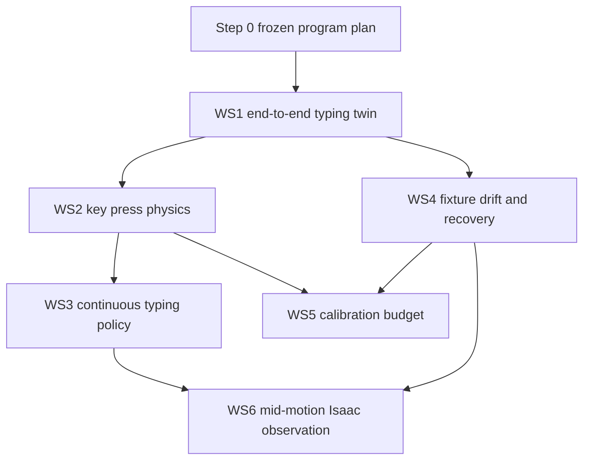

# Tactevra prioritized simulation program

- **Status:** Frozen program plan; simulation only
- **Branch:** `issue/190-isaac-sim-host`
- **Claim:** `891c993a45b38a3e7ef066738af494c26c979b77`
- **Date:** 2026-10-04
- **Owners:** AI/model and simulation lane, with arm/runtime contract review
- **Authority:** None. This plan cannot create a command, execution permit,
  transport payload, controller write, hardware write, or physical movement.

## Program objective

Build a reproducible digital-twin and fault-injection program that connects
intent, deterministic typing semantics, perception evidence, arm planning,
simulated motion and contact, device behavior, and independent effect
verification. The program answers which software contracts work in simulation,
which physical performance ranges appear feasible, and which measurements are
required before any physical claim.

The program does not qualify hardware. Every unmeasured physical quantity is a
declared sensitivity range. Results remain `EXPLORATORY_SIMULATION_ONLY` until
the corresponding physical source is measured and admitted through its own
procedure.

## Mandatory program controls

These controls apply to every workstream and override convenience or speed.

1. Hardware access, writes, movements, controller commands, execution permits,
   transport, and physical authority remain exactly zero.
2. Each workstream begins with a separate claim commit. Its fixture, identities,
   ranges, metrics, decision rules, random seeds, and stop rules are committed
   before execution.
3. Failed or superseded attempts remain hash-bound in external evidence and are
   summarized without rewriting their original outcome.
4. A workstream may not promote a single synthetic value as a measured physical
   constant. Ranges are reported with the sampling design that produced them.
5. Dual-GPU work records each GPU identity, driver, CUDA, Python, MuJoCo,
   MuJoCo Warp, Warp, Isaac, and operating-system version. Numerical payloads
   must match exactly where the same deterministic computation is expected;
   otherwise a predeclared tolerance and reason are required.
6. One compact, hash-bound repository summary and one external manifest are
   preferred per workstream. Raw frames, tensors, trajectories, and simulator
   caches remain external.
7. Every external manifest inventories exact relative paths, byte sizes, and
   SHA-256 values. Completion requires a verified second copy. The backup root
   must be supplied explicitly; if it is unavailable, the workstream reports
   `BLOCKED_BACKUP` rather than claiming completion.
8. Each workstream reports hardware-write count, physical-movement count,
   command count, permit count, transport count, render count, physics-step
   count, training-run count, and physical-authority state.
9. The source-archive check, maintained documentation check, focused tests, and
   `git diff --check` run before every result commit.
10. A later workstream may start early only when every dependency is satisfied,
    its fixture is frozen, and it does not compete for CPU, disk, or GPU capacity
    with a higher-priority run.

## Current no-preemption dependency

The paired 96-versus-192 residual-obstruction comparison was already active
when this program was requested. The observed process is:

```text
run_full_paired_training.py --profile ASSUMED_LOW --workers 8 --maximum-epochs 18
```

No program GPU process may start until that campaign finishes or fails and its
own owner records the outcome. Step 0 planning and CPU-only implementation may
proceed. This program must not terminate, reprioritize, alter, or reuse that
process or its outputs.

## Shared evidence and determinism contract

Each workstream freezes one manifest with:

- program, workstream, schema, commit, fixture, catalog, model, simulator asset,
  and source hashes;
- all random seeds and partition identities;
- physical sensitivity ranges and units;
- selected GPU UUID, driver, runtime, and simulator versions;
- expected output identities and admission rules;
- zero-authority counters; and
- backup source and destination receipts.

Randomized scenarios use a counter-based seed derived from the manifest hash,
scenario identity, and repetition index. CI subsets use a strict subset of the
same identities. Re-running a subset does not create new samples.

Timing is reported separately from correctness. Wall-clock timing is descriptive
unless a workstream explicitly freezes a performance gate. Simulator throughput
cannot be presented as expected hardware throughput.

## Dependency order



Workstreams execute in numerical order. The graph identifies implementation
dependencies; it does not authorize out-of-order GPU execution.

## Workstream 1: end-to-end typing digital twin

### Objective

Create a deterministic, zero-authority closed-loop regression harness from
typed user intent through simulated device effect and independent verification.
It becomes the common fault-injection boundary for later workstreams.

### Questions answered

- Does a valid intent preserve the user's exact requested text?
- Does deterministic compilation preserve semantic target order, repeats,
  punctuation, numbers, and every modifier or phone-layer transition?
- Do perception, fusion, planning, simulated motion, device state, and effect
  verification agree on each committed character?
- Does the system detect an invalid Sticky Keys configuration, phone-layer
  mismatch, autocorrect, predictive text, missing event, duplicate event, wrong
  event, stale observation, or impossible target?
- Can a small CI subset reproduce the full harness semantics and receipt?

### Frozen inputs

- Closed intent schema: `TYPE_TEXT`, `PRESS_KEY`, `CLARIFY`, and `REFUSE`.
- The exact admitted simulation target catalog at workstream freeze. Catalog
  cardinality is never inferred from a renderer or planner output.
- Deterministic keyboard compiler and explicit Sticky Keys state machine.
- Deterministic phone layer machine with letters, shift, numbers, symbols,
  backspace, and enter/action transitions.
- `ModelMotionBatchV2` remains the AI-to-arm boundary. No joint, PWM, serial,
  Waveshare, permit, or transport field is added.
- Analytic target geometry is the default perception mode. A small exact
  allowlist of fixed strings and faults uses retained Isaac-rendered perception
  after the no-preemption dependency clears.
- Existing zero-authority arm-runtime IK and screening interfaces and the
  kinematically consistent MuJoCo model.

### Scenario fixture

The full fixture contains:

- `Hello 2026!` on keyboard and phone;
- every supported printable ASCII character;
- repeated keys, including repeated shifted symbols;
- all lower/upper, upper/upper, symbol/symbol, space-to-shift, trailing-capital,
  phone shift, phone numeric, and phone symbol-layer transitions;
- 10,000 seeded random text payloads for keyboard and 10,000 for phone;
- lengths sampled from the declared set `1, 2, 4, 8, 16, 32, 64, 128` with
  equal identity allocation, plus explicit empty and unsupported cases;
- exact quoted-text preservation cases and ambiguous unquoted requests; and
- an autocorrect/predictive-text-on phone case that must be detected.

The random alphabet is the compiler-supported printable set frozen in the
manifest. Unsupported characters are separate negative tests and may never be
silently substituted.

### Closed-loop stages

```text
intent JSON
  -> exact-text guard
  -> keystroke or phone-layer compiler
  -> ordered semantic targets
  -> analytic or allowlisted Isaac perception
  -> fusion and named-target admission
  -> zero-authority IK and collision screening
  -> MuJoCo kinematic motion receipt
  -> simulated keyboard/phone actuation
  -> simulated host event or screen-state log
  -> independent text/state verification
```

Sticky Keys models latch, lock, unlock, the five-press shortcut, and the
two-key-disable setting. The commissioned simulation profile requires the
five-press shortcut disabled and simultaneous-key disable off. Phone
commissioning requires autocorrect and predictive text off. The required
negative case turns them on and must produce a configuration mismatch rather
than an accepted exact-text result.

### Fault-injection hooks

Named hooks are frozen for: stale frame, stale telemetry, missing target,
target displacement, perception abstention, fusion rejection, unreachable IK,
collision rejection, dropped press, duplicate press, wrong press, delayed
press, Sticky Keys state divergence, phone-layer divergence, autocorrect,
predictive replacement, readback delay, and verification mismatch.

### Outputs

- One deterministic full-run receipt and one CI-subset receipt.
- Per-scenario ordered stage trace with no authority-bearing fields.
- Simulated keyboard event log and phone screen-state/readback log.
- Fault-injection registry consumed by Workstreams 4 and 6.
- Stage-latency distributions and exact failure attribution.

### Metrics

- exact-text success rate;
- schema validity and exact quoted-text preservation;
- semantic-target order and repeat preservation;
- compiler versus simulated OS/device-state disagreements;
- independent verification agreement;
- false acceptance of injected faults;
- per-stage median, p95, p99, and maximum latency; and
- full/CI deterministic receipt agreement on shared identities.

### Pass and stop rules

Pass requires 100% schema validity, zero altered quoted payloads, 100% exact text
for all supported no-fault scenarios, zero target-order differences, zero
compiler/device-state disagreements, 100% independent verification agreement,
and detection of every injected deterministic fault at its declared stage.
Autocorrect-on and predictive-text-on must fail commissioning and must not be
counted as typing failures after admission. Any silent substitution, accepted
state divergence, authority-bearing output, or non-deterministic shared receipt
stops the workstream. Latency is descriptive in WS1 and becomes a policy metric
in WS3.

### Dependencies and compute estimate

Step 0, admitted schemas/catalogs, existing compiler/runtime interfaces, and the
finished 96/192 job are required. CPU implementation and analytic runs are
estimated at 30–90 minutes. The exact Isaac subset is estimated at 15–45 GPU
minutes total. MuJoCo replay is estimated below 15 GPU minutes. The workstream
must benchmark a smoke before scheduling the full subset.

## Workstream 2: key press physics in MuJoCo Warp

### Objective

Build an exploratory contact model that maps landing error and press timing to
key actuation, neighbor contact, repeat behavior, phone tap, and long press.

### Questions answered

- Which press depth, dwell, approach speed, and release speed ranges actuate
  once without neighbor contact or repeat?
- How does fingertip radius change the per-key envelope?
- Which ranges fail first on `GRAVE`, `EQUAL`, `Z`, and `SHIFT`?
- Which phone contact-area and duration ranges separate tap from long press?

### Predeclared physical sensitivity ranges

All values are exploratory until measured:

| Parameter | Range |
|---|---:|
| keycap top width and height | 11–15 mm each |
| key travel | 1–5 mm |
| actuation depth | 30–90% of travel |
| bottom-out depth | 90–110% of declared travel |
| key spring rate | 0.1–2.5 N/mm |
| key damping | 0.001–0.2 N·s/mm |
| actuation force | 0.2–3.0 N |
| fingertip sphere/capsule radius | 1–6 mm |
| commanded press depth | 0.5–7 mm |
| dwell | 10–750 ms |
| approach speed | 2–120 mm/s |
| release speed | 2–160 mm/s |
| OS repeat delay | 200–1,200 ms |
| OS repeat period | 20–250 ms |
| phone effective contact radius | 1–7 mm |
| phone accepted contact duration | 20–500 ms |
| phone long-press threshold | 250–1,200 ms |

Landing errors use the frozen MW2UC fixed-approach/calibrated-residual ranges,
including 3–4 mm effective regions, random noise `0.001–0.002 rad`, fixed-source
magnitude `0.002–0.008 rad`, and residual fractions `0–0.25` for focused runs.
Broader failure controls retain residual `0.5–1.0`.

### Model and outputs

Each keycap is a prismatic joint with explicit travel, spring, damping,
actuation surface, actuation threshold, and bottom-out. The fingertip is a
sphere and a capsule in separate frozen families. Contact events drive a
simulated OS repeat model; they never create real host input.

The phone surface models effective contact area and contact duration only. It
does not claim electrostatic touchscreen accuracy.

Output is a per-key press-recipe envelope over depth, dwell, approach, release,
and fingertip radius, with highlighted limiting results for `GRAVE`, `EQUAL`,
`Z`, and `SHIFT`.

### Metrics

- single-actuation probability and confidence bound;
- partial-press, double-actuation, neighbor-contact, bottom-out, and auto-repeat
  rates;
- peak penetration, peak contact force, dwell above actuation, and release
  completion;
- phone tap, no-tap, multiple-tap, and long-press rates; and
- per-key robust-envelope volume across the declared physical range.

### Pass and stop rules

The exploratory envelope admits a cell only when every sampled landing has one
actuation, zero neighbor contact, zero double actuation, zero repeat, successful
release, finite state, and no solver overflow. Phone cells require exactly one
tap and no long press. A key with no admitted recipe is reported infeasible; its
range is not widened after results. Nonfinite contact state, penetration beyond
the declared bottom-out tolerance, or cross-GPU disagreement stops the run.

### Dependencies and compute estimate

WS1 actuation/event interfaces, MW2UC landing model, and a frozen contact asset
are required. A power smoke determines shard count. Expected compute is 1–4 GPU
hours across both RTX 3090s, plus 30–90 minutes for admission and summarization.

## Workstream 3: continuous typing motion policy

### Objective

Evaluate direct key-to-key motion without mandatory parking while preserving a
single approach direction, collision clearance, landing accuracy, and verified
device effect.

### Questions answered

- What speed/accuracy frontier is achievable for direct transitions?
- Which directed key pairs require parking or a higher hover?
- How does continuous typing compare with the parked closed loop?

### Inputs and ranges

- Exact simulation catalog frozen after WS1.
- WS2 press envelopes and fingertip families.
- Every ordered key-to-key pair, including repeated-key self transitions.
- Hover height `2–30 mm`.
- Cartesian transition speed `10–400 mm/s`.
- approach and release speed within the WS2 admitted envelope;
- dwell within the WS2 admitted envelope;
- random noise `0–0.002 rad`;
- constant approach-direction backlash `0–0.008 rad`; and
- per-key residual correction `0–0.25` of the fixed simulated bias.

### Outputs and metrics

Output is a speed-accuracy curve and a pair-policy table selecting direct,
higher-hover, or parked transition for each directed pair. Metrics are verified
characters per minute, miss rate, neighbor-contact rate, collision-screen
rejection rate, path length, transition latency, peak joint speed, and fraction
of pairs requiring park.

### Pass and stop rules

Every admitted transition must pass the existing arm-runtime joint-limit and
collision screens, preserve the single approach direction, remain inside the
selected WS2 landing envelope, and produce exactly one simulated event. No
aggregate rate may hide a failing pair. The recommended exploratory policy is
the fastest policy with zero sampled collision/neighbor contact and with the
predeclared per-pair miss upper bound no worse than the parked reference. If no
continuous class satisfies those rules, the result recommends parking.

### Dependencies and compute estimate

WS1 and WS2 must complete. Expected Warp compute is 2–8 GPU hours depending on
catalog cardinality and power analysis. CPU collision admission and summary are
estimated at 1–3 hours.

## Workstream 4: fixture drift and recovery

### Objective

Use WS1 fault hooks to measure detection and recovery for displaced fixtures
and incorrect simulated device effects.

### Questions answered

- How quickly does the closed loop detect drift or a wrong effect?
- How many incorrect characters can be committed first?
- Which faults can be corrected by re-observation or backspace, and which must
  abort?

### Inputs and ranges

- Keyboard and phone translations independently swept over `±1–10 mm` in X/Y.
- In-plane rotation `±0.25–5 degrees`.
- Single and burst missed presses, wrong keys, and double presses.
- Observation/readback delay `0–2 seconds`.
- Drift onset before planning, during travel, immediately before contact, and
  after effect verification.

### Recovery state machine

```text
OBSERVE -> PLAN -> SIMULATE_PRESS -> VERIFY
   |          |          |            |
   +--STOP----+----------+------------+
                     mismatch
                        |
          REOBSERVE -> RELOCALIZE
                        |
          unchanged? retry once : abort/replan
                        |
           wrong committed text -> verified backspace correction
```

Backspace correction is allowed only after readback identifies the exact wrong
effect and the correction itself is independently verified. Ambiguous state
aborts.

### Metrics and decision rules

Metrics are detection latency, committed wrong characters before detection,
relocalization success, correction success, abort correctness, attempts, and
total recovery time. Pass requires every injected deterministic fault to be
detected, no ambiguous state to continue, no more than one wrong character
before detection under per-character verification, and at least 99% recovery
success for faults declared recoverable by the frozen fixture. False recovery
or continuing after an ambiguous readback stops the workstream.

### Dependencies and compute estimate

WS1 must complete; WS2 recipes are used when available but are not required for
state-machine unit tests. Expected CPU time is 30–120 minutes and optional Warp
replay is 15–60 GPU minutes.

## Workstream 5: calibration procedure budget

### Objective

Estimate how many per-key probes are needed to reduce fixed landing bias to the
MW2UC 10–25% residual range and how frequently recalibration would be needed
under a declared drift range.

### Questions answered

- How many probes per key meet the residual target with conservative coverage?
- What total commissioning time follows from the selected probe count?
- Which drift rates imply hourly, daily, or session-based recalibration?

### Inputs and ranges

- Probe counts `1, 2, 3, 5, 8, 13, 21, 34` per key.
- Landing-observation noise `0.1–2.0 mm`.
- Outlier probability `0–5%` with bounded `1–5 mm` magnitude.
- Fixed landing bias corresponding to MW2UC source ranges.
- Linear translational drift `0.01–0.5 mm/hour`.
- rotational drift `0.01–0.25 degree/hour`.
- Session duration `0.25–8 hours`.
- Residual target `10%, 15%, 20%, 25%` of initial fixed landing bias.

### Outputs and metrics

Output is a probe-count table per target family, total commissioning-time range,
and recalibration policy indexed by measured drift. Metrics are residual-bias
coverage, confidence-interval width, outlier rejection, probe failures, total
press count, elapsed simulated commissioning time, and time until the selected
safe-region margin is consumed.

### Pass and stop rules

A probe count is admitted only when the predeclared confidence bound covers the
target residual for every key. The recalibration interval uses the earliest
time any key's conservative margin is exhausted. If no probe count through 34
meets the target, the workstream reports that physical calibration method as
insufficient. It does not relax the target or extrapolate beyond the grid.

### Dependencies and compute estimate

WS2 supplies contact-valid probes; WS4 supplies detection/relocalization
semantics. Expected compute is CPU dominated, 30–120 minutes, with less than 30
GPU minutes for optional Warp validation.

## Workstream 6: mid-motion observation in Isaac

### Objective

Render the arm along WS3 trajectories and determine whether target observation
can be admitted while the arm remains in view, without confusing arm-covered
regions with visible targets.

### Questions answered

- Does projected arm geometry conservatively cover the rendered arm mask?
- Which targets remain observable at each trajectory phase?
- Does 9 fps exposure blur invalidate the uncovered-region obstruction check?

### Inputs and ranges

- Frozen WS3 trajectories and pair-policy identities.
- Frozen exact-nadir camera family at 700, 850, and 1,000 mm.
- Frame rate fixed at 9 fps for the primary family.
- Exposure duration `1/120, 1/60, 1/30, 1/15, 1/9 second`.
- Joint-state/capture timestamp offset `0–111 ms`.
- Projection dilation derived only as a range from the unmeasured MW2UC joint
  profiles; it is never installed as a physical margin.
- Held-out simulator audit masks disjoint by trajectory, lighting appearance,
  and camera identity from any development tuning.

### Method and outputs

Isaac renders RGB, motion vectors, depth, semantic arm masks, and target masks.
The analytic arm silhouette uses capture-time joint state. Positive arm-mask
overlap is required in the fixture. The obstruction check runs only for target
safe-region pixels outside the dilated projected silhouette; covered targets
must abstain.

Output is a simulation-only mid-motion gate receipt, per-phase observable-target
map, mask-overlap diagnostics, and failure examples. Physical mid-motion use
remains blocked regardless of result.

### Metrics and pass/stop rules

Metrics are projected-mask recall and precision against held-out masks,
safe-region uncovered fraction, covered-target false-clear count, uncovered
obstruction miss/false-stop rates, blur-stratified results, and timestamp-offset
sensitivity. Pass requires positive overlap cases, zero covered-target false
clear, every tested target classified covered or evaluated, held-out projected
mask recall lower bound at least 99%, and the separately frozen residual
obstruction limits on uncovered pixels. Any skipped covered target, source-mask
leakage, or use of perfect simulator masks as runtime inputs stops the gate.

### Dependencies and compute estimate

WS3 trajectories and WS4 recovery behavior must be frozen. Estimated Isaac
render time is 3–10 GPU hours after a smoke-derived throughput estimate;
evaluation and mask scoring are estimated at 1–3 CPU hours. Isaac work never
runs while a higher-priority GPU campaign is active.

## Program execution and reporting protocol

For each workstream:

1. verify higher-priority dependencies and GPU/CPU/disk availability;
2. add a narrow active claim and commit it;
3. commit the fixture, manifest schema, metrics, and rules before execution;
4. execute a bounded smoke and visually or numerically audit its semantics;
5. preserve failed smoke evidence and amend implementation only when the frozen
   contract was violated;
6. execute independent device shards without combining their raw identities;
7. admit exact allowlisted outputs, compare cross-GPU numerical payloads, and
   create the second verified backup;
8. append the evidence ledger and update only the simulation-lane workplan row;
9. run maintained checks, commit, and push; and
10. report:
   - what the workstream showed and why it matters;
   - key numbers;
   - preserved failures;
   - the resulting hardware-plan change; and
   - the next dependency.

If a required answer can only come from a physical measurement, the program
stops at that dependency and asks the operator before any physical procedure.

## Completion definition

The program completes when all six workstreams have final simulation receipts,
all external evidence has two verified copies, failures remain visible, and the
shared workplan identifies every remaining physical dependency. Completion does
not authorize hardware use. It produces a prioritized measurement and design
plan for later commissioning.
